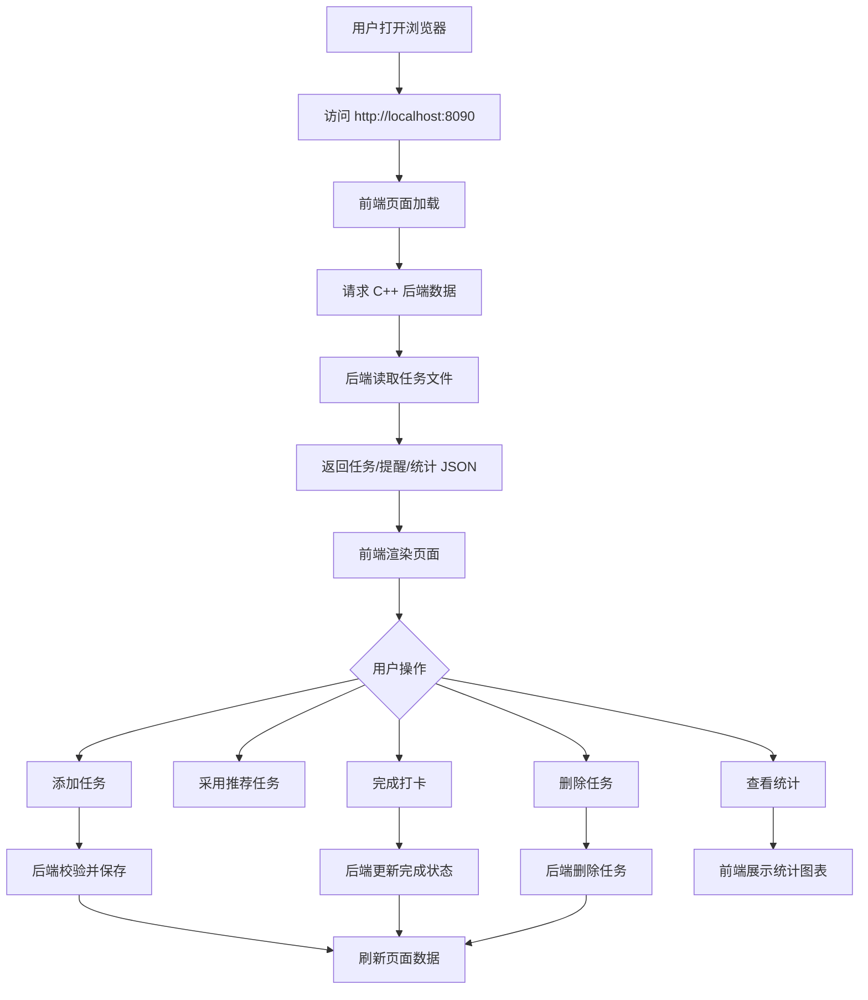
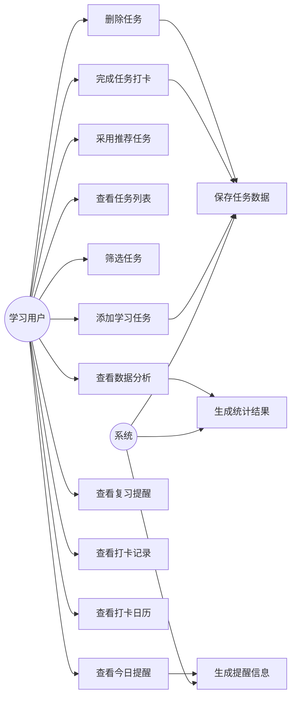
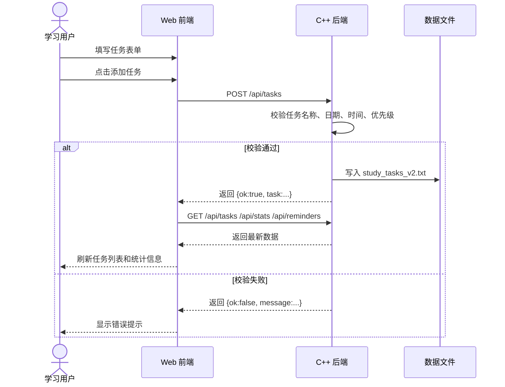
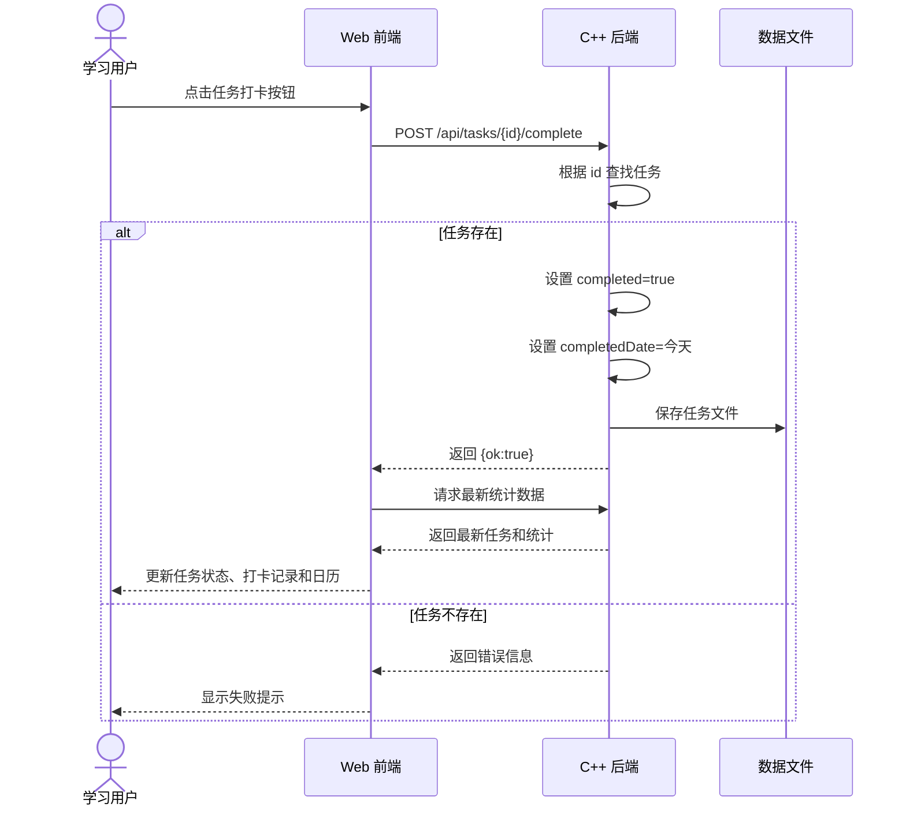
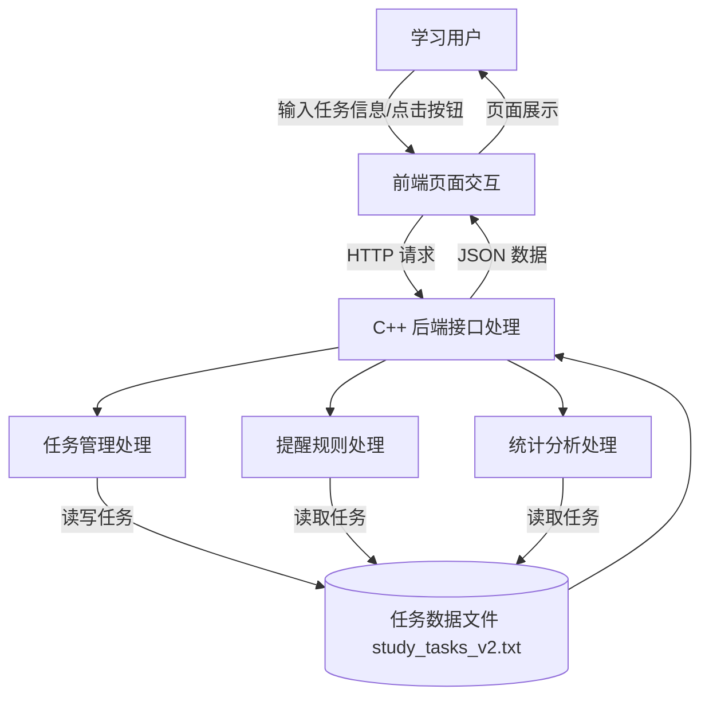
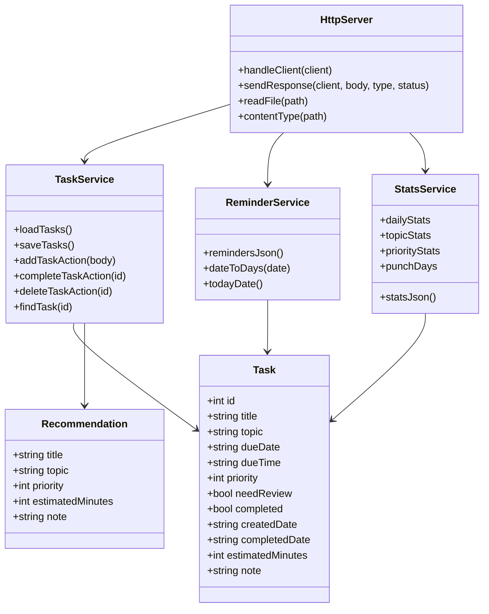
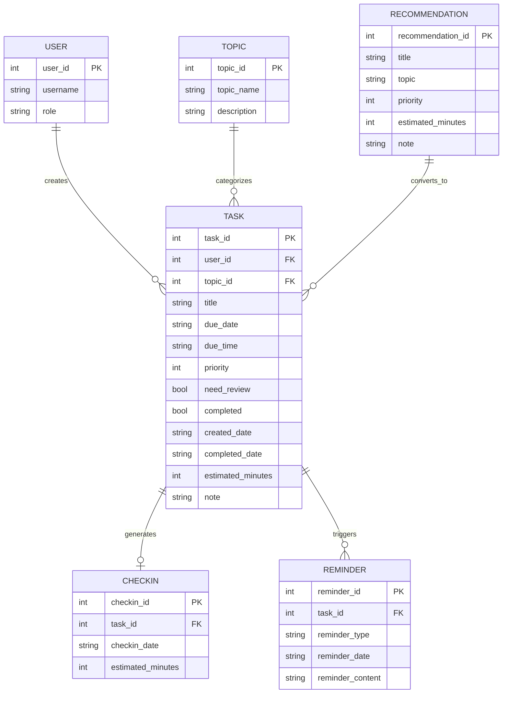

# 学习养成计划系统需求规格说明书

## 1. 引言

### 1.1 文档目的

本文档针对“2.5 学习养成计划”选题，对系统需求进行分析和建模，明确系统的用户需求、功能需求、数据需求、非功能需求、运行环境和系统依赖项。

本文档基于项目最终版本 `fullstack_v2` 编写。该版本采用前端 + C++ 后端结构：

- 前端使用 HTML、CSS、JavaScript 实现页面展示和用户交互。
- 后端使用 C++ 实现本地 HTTP 服务、任务管理、提醒规则、打卡处理和统计分析。
- 数据使用文本文件 `study_tasks_v2.txt` 持久化保存。

### 1.2 项目背景

学习任务较多时，用户容易出现任务遗忘、复习不及时、学习进度不清晰等问题。本项目希望通过学习任务管理、优先级提醒、复习提醒、打卡记录和数据分析功能，帮助用户形成持续学习习惯，提高学习计划执行效率。

### 1.3 项目目标

系统目标如下：

1. 支持用户添加、查看、筛选、删除学习任务。
2. 支持系统推荐任务，降低用户创建任务成本。
3. 支持设置任务主题、完成时间、优先级、预计时长和复习提醒。
4. 支持任务完成打卡并生成打卡记录。
5. 支持根据截止时间和优先级生成提醒。
6. 支持根据完成日期生成复习提醒。
7. 支持以进度条、统计卡片、打卡日历等形式展示数据。
8. 支持后端持久化保存任务数据。

### 1.4 术语说明

| 术语 | 说明 |
|---|---|
| 学习任务 | 用户计划完成的一项学习活动 |
| 推荐任务 | 系统预设的学习任务模板 |
| 打卡 | 用户完成任务后记录完成状态和完成日期 |
| 复习提醒 | 任务完成后第 1、3、7 天提醒用户复习 |
| 前端 | 用户直接看到和操作的网页界面 |
| 后端 | 负责处理数据、规则和接口的 C++ 服务 |
| API | 前端和后端通信的接口 |
| ER 图 | 数据库概念设计图，用于描述实体及关系 |

## 2. 用户需求说明

### 2.1 用户角色

本系统主要面向普通学习用户，当前版本为单用户本地系统。

| 用户角色 | 角色说明 | 主要目标 |
|---|---|---|
| 学习用户 | 使用系统管理学习任务的人 | 添加任务、查看提醒、完成打卡、查看学习统计 |
| 系统 | 自动执行数据处理和提醒规则的程序 | 保存数据、生成提醒、统计完成率 |

### 2.2 业务需求说明

#### 2.2.1 学习任务管理需求

用户需要能够创建学习任务，并设置任务的基本属性。任务属性包括任务名称、学习主题、完成日期、完成时间、优先级、预计时长、备注和是否需要复习提醒。

用户创建任务后，系统应将任务保存到后端数据文件中，并在页面任务列表中展示。

#### 2.2.2 系统推荐任务需求

用户在不知道添加什么任务时，可以从系统推荐任务中选择。系统推荐任务由后端提供，前端展示推荐任务卡片。用户点击“采用”后，推荐任务内容自动填入添加任务表单，用户可修改后提交。

#### 2.2.3 任务提醒需求

系统需要根据任务截止时间和优先级生成提醒。

提醒规则如下：

| 任务情况 | 提醒规则 |
|---|---|
| 任务已逾期且未完成 | 显示“已逾期”提醒 |
| 任务今天截止且未完成 | 显示“今天截止”提醒 |
| 高优先级任务 7 天内截止 | 显示“高优先级，建议每天推进” |
| 中优先级任务 3 天内截止 | 显示“中优先级，截止时间较近” |
| 低优先级任务 1 天内截止 | 显示“低优先级，临近截止” |

#### 2.2.4 复习提醒需求

用户完成任务后，如果该任务设置了复习提醒，系统应在完成后的第 1、3、7 天提醒用户复习。

#### 2.2.5 打卡记录需求

用户完成任务后，可以点击“打卡”。系统应将任务状态改为已完成，并记录完成日期。已完成任务应显示在打卡记录表和打卡日历中。

#### 2.2.6 数据展示需求

系统应通过可视化方式展示用户学习情况，包括：

1. 总任务数。
2. 已完成任务数。
3. 未完成任务数。
4. 完成率。
5. 预计学习时长。
6. 每日任务添加数和完成率。
7. 按主题统计完成率。
8. 按优先级统计任务数量。
9. 打卡日历。

#### 2.2.7 数据持久化需求

系统关闭后，任务数据不应丢失。后端需要将任务数据保存到本地文本文件 `study_tasks_v2.txt` 中。系统重新启动后，应从文件中恢复任务数据。

### 2.3 User Story

| 编号 | User Story | 验收标准 |
|---|---|---|
| US-01 | 作为学习用户，我希望添加学习任务，以便记录接下来要完成的学习内容。 | 用户提交有效任务后，任务出现在任务列表中 |
| US-02 | 作为学习用户，我希望设置任务优先级，以便区分重要任务和普通任务。 | 任务列表中显示高、中、低优先级标签 |
| US-03 | 作为学习用户，我希望使用系统推荐任务，以便快速创建学习计划。 | 点击推荐任务后，表单自动填入推荐内容 |
| US-04 | 作为学习用户，我希望看到今日提醒，以便及时处理临近截止任务。 | 页面左侧显示后端生成的提醒信息 |
| US-05 | 作为学习用户，我希望完成任务后打卡，以便记录学习成果。 | 点击打卡后任务变为已完成，并生成完成日期 |
| US-06 | 作为学习用户，我希望看到打卡日历，以便了解自己哪些天完成了任务。 | 完成任务当天在日历中高亮显示 |
| US-07 | 作为学习用户，我希望看到每日任务完成率，以便分析学习效率。 | 数据分析页面显示每日添加数、完成数和完成率 |
| US-08 | 作为学习用户，我希望看到按主题统计，以便了解不同学习主题的完成情况。 | 主题统计区域显示每个主题的完成率 |
| US-09 | 作为学习用户，我希望删除错误任务，以便保持任务列表准确。 | 删除确认后，任务从列表和统计中移除 |
| US-10 | 作为学习用户，我希望数据能保存，以便下次打开系统还能继续使用。 | 关闭后端再重启，任务数据仍然存在 |

### 2.4 业务流程图



## 3. 需求分析建模

### 3.1 用例图



### 3.2 添加任务时序图



### 3.3 完成打卡时序图



### 3.4 数据流图



### 3.5 类图



## 4. 数据建模

### 4.1 ER 图

虽然当前项目使用文本文件保存数据，但从数据库概念设计角度，可以抽象出以下实体：用户、学习任务、推荐任务、打卡记录、学习主题、提醒记录。

当前版本为单用户系统，因此用户实体可以作为后续扩展保留。



### 4.2 数据字典

#### 4.2.1 TASK 学习任务表

| 字段名 | 中文名 | 类型 | 是否必填 | 约束/说明 |
|---|---|---|---|---|
| task_id | 任务编号 | int | 是 | 主键，唯一标识任务 |
| user_id | 用户编号 | int | 否 | 当前版本单用户，后续扩展使用 |
| topic_id | 主题编号 | int | 否 | 当前版本直接保存 topic 字符串 |
| title | 任务名称 | string | 是 | 不能为空 |
| topic | 学习主题 | string | 是 | 不能为空，如 C++、英语、数据结构 |
| due_date | 完成日期 | string | 是 | 格式 YYYY-MM-DD |
| due_time | 完成时间 | string | 是 | 格式 HH:MM |
| priority | 优先级 | int | 是 | 1 低，2 中，3 高 |
| need_review | 是否复习提醒 | bool | 是 | true 表示需要复习提醒 |
| completed | 是否完成 | bool | 是 | true 表示已完成 |
| created_date | 创建日期 | string | 是 | 系统自动生成 |
| completed_date | 完成日期 | string | 否 | 未完成时为 `-` |
| estimated_minutes | 预计时长 | int | 是 | 单位：分钟 |
| note | 备注 | string | 否 | 学习目标或补充说明 |

#### 4.2.2 RECOMMENDATION 推荐任务表

| 字段名 | 中文名 | 类型 | 是否必填 | 约束/说明 |
|---|---|---|---|---|
| recommendation_id | 推荐任务编号 | int | 是 | 主键，唯一标识推荐任务 |
| title | 推荐任务名称 | string | 是 | 系统预设 |
| topic | 推荐主题 | string | 是 | 如英语、C++、数据结构 |
| priority | 推荐优先级 | int | 是 | 1 低，2 中，3 高 |
| estimated_minutes | 推荐预计时长 | int | 是 | 单位：分钟 |
| note | 推荐说明 | string | 否 | 学习建议 |

#### 4.2.3 CHECKIN 打卡记录表

| 字段名 | 中文名 | 类型 | 是否必填 | 约束/说明 |
|---|---|---|---|---|
| checkin_id | 打卡编号 | int | 是 | 主键 |
| task_id | 任务编号 | int | 是 | 外键，关联任务 |
| checkin_date | 打卡日期 | string | 是 | 用户完成任务日期 |
| estimated_minutes | 学习时长 | int | 是 | 来源于任务预计时长 |

说明：当前代码中未单独保存 CHECKIN 表，而是通过任务的 `completed` 和 `completedDate` 字段生成打卡记录。ER 图中单独建模是为了体现数据库概念设计。

#### 4.2.4 REMINDER 提醒记录表

| 字段名 | 中文名 | 类型 | 是否必填 | 约束/说明 |
|---|---|---|---|---|
| reminder_id | 提醒编号 | int | 是 | 主键 |
| task_id | 任务编号 | int | 是 | 外键，关联任务 |
| reminder_type | 提醒类型 | string | 是 | 截止提醒、复习提醒 |
| reminder_date | 提醒日期 | string | 是 | 应提醒的日期 |
| reminder_content | 提醒内容 | string | 是 | 展示给用户的提醒文本 |

说明：当前代码中提醒记录不落盘保存，而是由后端根据任务实时计算生成。

#### 4.2.5 TOPIC 学习主题表

| 字段名 | 中文名 | 类型 | 是否必填 | 约束/说明 |
|---|---|---|---|---|
| topic_id | 主题编号 | int | 是 | 主键 |
| topic_name | 主题名称 | string | 是 | 如 C++、英语、数据结构 |
| description | 主题描述 | string | 否 | 主题说明 |

说明：当前代码中主题直接保存在任务字段 `topic` 中，后续如果接入数据库，可以拆分成单独主题表。

#### 4.2.6 USER 用户表

| 字段名 | 中文名 | 类型 | 是否必填 | 约束/说明 |
|---|---|---|---|---|
| user_id | 用户编号 | int | 是 | 主键 |
| username | 用户名 | string | 是 | 当前版本暂不实现登录 |
| role | 用户角色 | string | 是 | 默认为学习用户 |

说明：当前系统为单用户本地系统，用户表作为后续扩展模型。

## 5. 功能需求说明

### 5.1 任务添加功能

系统应允许用户添加任务。用户提交任务后，后端应校验字段合法性。如果校验通过，系统保存任务并返回成功信息。如果校验失败，系统返回错误提示。

### 5.2 任务列表功能

系统应展示所有任务，并显示任务名称、主题、截止时间、优先级、预计时长、复习提醒状态、完成状态和备注。

### 5.3 任务筛选功能

系统应支持按全部任务、未完成任务、已完成任务和高优先级任务进行筛选。

### 5.4 推荐任务功能

系统应提供若干推荐任务，用户可以采用推荐任务并填入任务表单。

### 5.5 任务打卡功能

系统应支持用户将任务标记为完成。任务完成后，系统记录完成日期，并更新统计数据和打卡日历。

### 5.6 任务删除功能

系统应支持用户删除任务。删除前前端应弹出确认框，删除后系统刷新任务列表和统计数据。

### 5.7 提醒功能

系统应根据任务截止时间和优先级生成提醒。系统还应根据复习规则生成复习提醒。

### 5.8 统计分析功能

系统应统计总任务数、完成数、未完成数、完成率、预计学习时长、每日任务添加数、每日任务完成数、每日完成率和主题完成率。

### 5.9 打卡日历功能

系统应根据任务完成日期生成打卡日历。当某天存在打卡记录时，该日期应高亮显示。

## 6. 非功能性需求说明

### 6.1 开发环境

| 项目 | 说明 |
|---|---|
| 操作系统 | Windows |
| C++ 编译器 | MinGW g++ |
| 前端开发 | HTML、CSS、JavaScript |
| 后端开发 | C++、WinSock |
| 浏览器 | Microsoft Edge 或 Google Chrome |
| 编辑器 | VS Code、Dev-C++、Code::Blocks 或其他文本编辑器 |

### 6.2 运行环境

| 项目 | 说明 |
|---|---|
| 操作系统 | Windows |
| 后端程序 | `backend/server.exe` |
| 后端端口 | 8090 |
| 访问地址 | `http://localhost:8090` |
| 数据文件 | `backend/study_tasks_v2.txt` |
| 浏览器 | 支持现代 JavaScript 的浏览器 |

### 6.3 系统依赖项

| 依赖项 | 说明 |
|---|---|
| WinSock2 | C++ 后端用于创建本地 HTTP 服务 |
| ws2_32 | 编译时需要链接 Windows 网络库 |
| g++ | 用于编译 C++ 后端 |
| 浏览器 Fetch API | 前端用于向后端发送 HTTP 请求 |
| 本地文件系统 | 后端保存任务数据 |

后端编译命令：

```powershell
g++ server.cpp -std=c++17 -lws2_32 -o server.exe
```

### 6.4 性能需求

1. 系统应能在普通 Windows 电脑上运行。
2. 本地任务数量在 1000 条以内时，页面操作应保持流畅。
3. 后端接口响应时间在本地环境下应保持在 1 秒以内。
4. 页面刷新数据时不应明显卡顿。

### 6.5 易用性需求

1. 用户应能通过浏览器直接访问系统。
2. 页面应有清晰的导航入口。
3. 添加任务表单字段应清晰易懂。
4. 重要数据应通过指标卡和进度条展示。
5. 删除任务前应进行确认。
6. 后端未启动时，前端应提示无法连接后端。

### 6.6 可靠性需求

1. 后端应在添加、删除、打卡后及时保存数据。
2. 系统重新启动后应能恢复历史任务数据。
3. 后端应校验关键输入，避免保存无效任务。
4. 前端请求失败时应显示提示，不应页面崩溃。

### 6.7 可维护性需求

1. 前端文件应按 HTML、CSS、JavaScript 分离。
2. 后端代码应按任务处理、提醒处理、统计处理、HTTP 处理等函数划分。
3. 测试用例、测试报告和缺陷跟踪文档应单独保存。
4. 后续可以扩展数据库、登录、任务修改等功能。

### 6.8 安全性需求

当前系统为本地课程项目，安全需求较简单：

1. 系统不存储用户密码。
2. 系统不上传用户数据到互联网。
3. 后端只用于本地访问。
4. 输入内容中的特殊分隔符会被处理，避免破坏文本文件格式。

## 7. 验收标准

系统满足以下条件时，可以认为项目达到基本验收要求：

1. 后端 `server.exe` 可以正常启动。
2. 浏览器可以访问 `http://localhost:8090`。
3. 用户可以成功添加任务。
4. 用户可以使用推荐任务。
5. 用户可以完成任务并生成打卡记录。
6. 用户可以删除任务。
7. 系统可以显示今日提醒和复习提醒。
8. 系统可以显示进度条、统计卡片、打卡日历和主题统计。
9. 任务数据可以保存到文件，重启后仍然存在。
10. 项目包含测试用例、测试报告和缺陷跟踪材料。

## 8. 附录：项目文件位置

最终版本位置：

```text
D:\Yiqian_Yang _Homework_c++\project\fullstack_v2
```

主要文件：

```text
backend/server.cpp
backend/server.exe
frontend/index.html
frontend/styles.css
frontend/app.js
docs/TEST_CASES.md
docs/TEST_REPORT.md
docs/DEFECT_TRACKING.md
docs/DESIGN_DESCRIPTION.md
README.md
```
