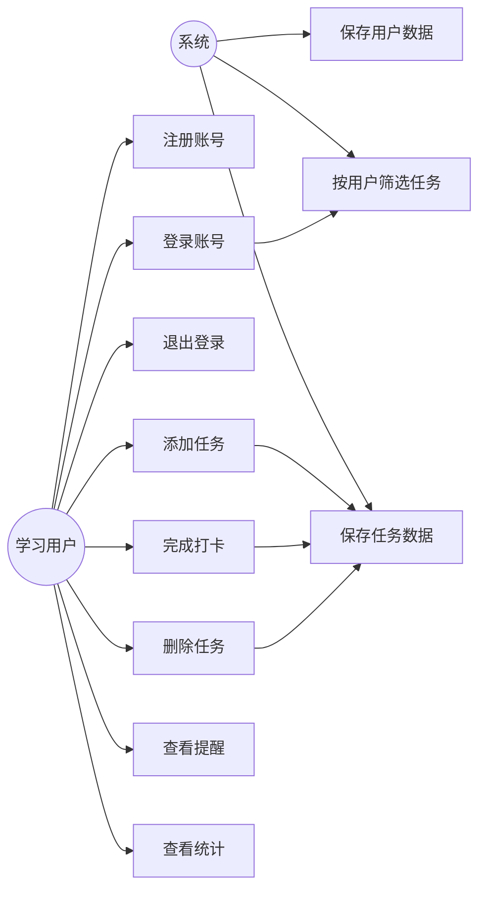
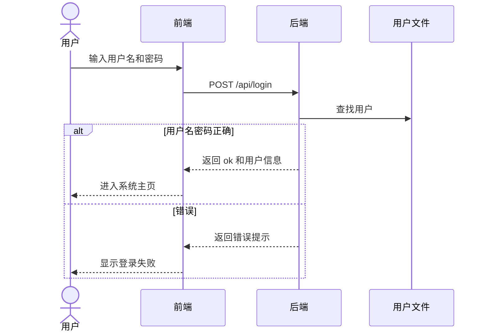
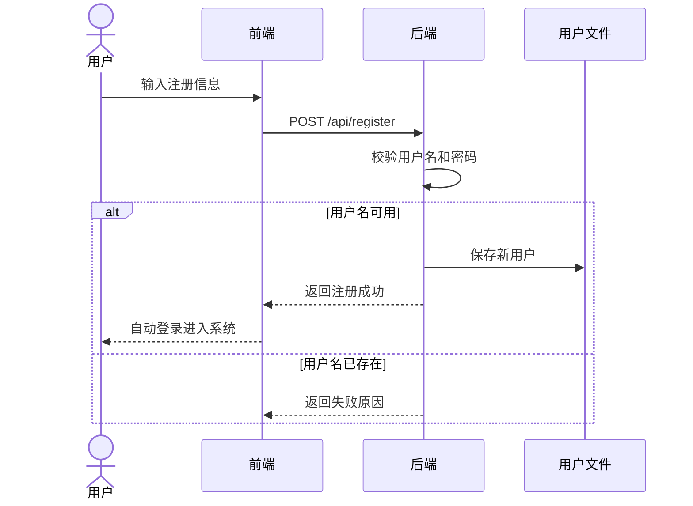
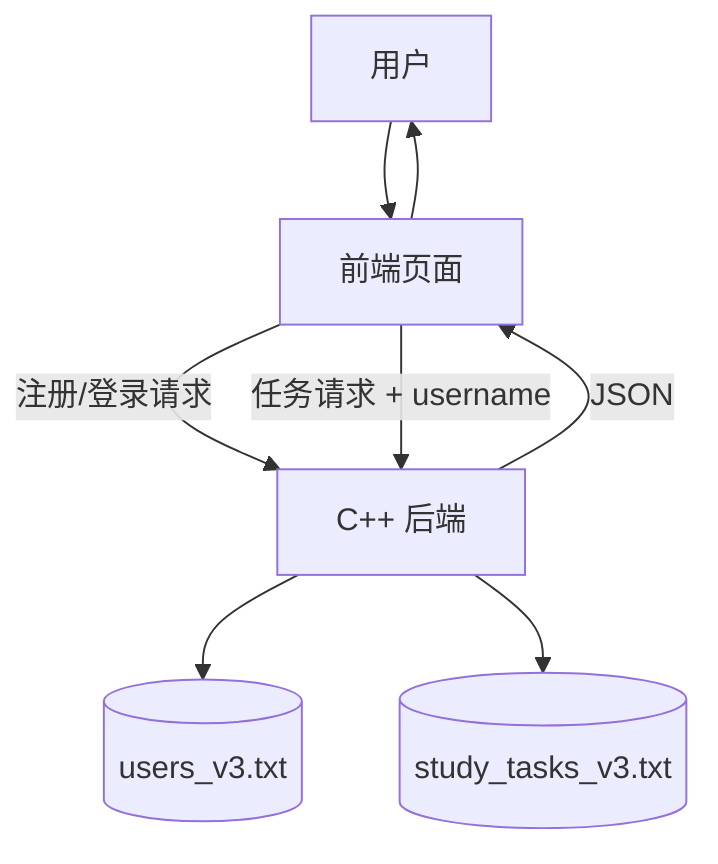
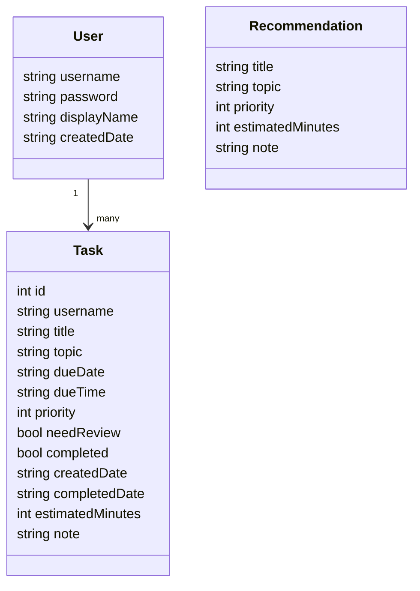
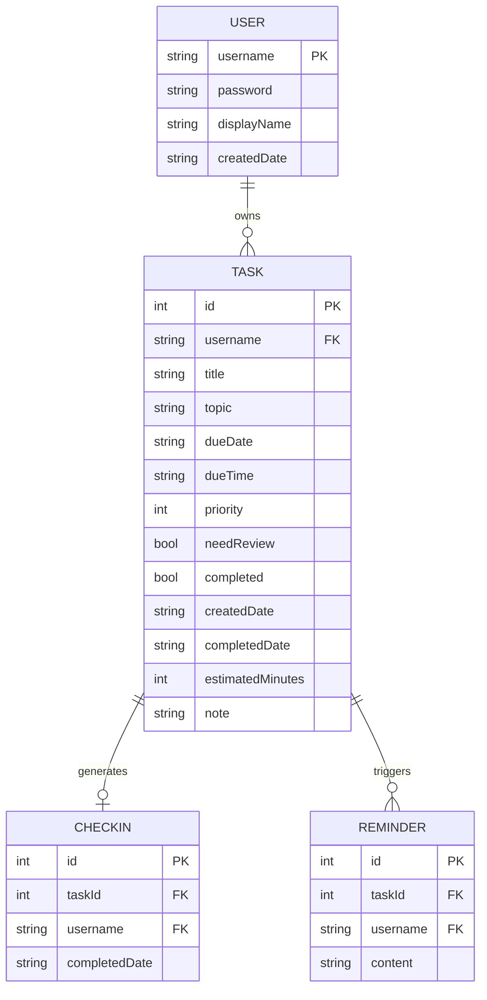

# V3 需求规格说明书

## 1. 用户需求说明

学习用户需要通过账号进入系统，管理自己的学习任务。系统应支持注册、登录、退出、任务管理、提醒、打卡、统计分析和数据保存。

## 2. 新增用户需求

### 2.1 注册需求

用户第一次使用系统时，应能创建账号。注册信息包括用户名、显示名称和密码。

验收标准：注册成功后自动进入系统。

### 2.2 登录需求

已有账号用户可以通过用户名和密码登录。

验收标准：登录成功后进入学习任务主页，登录失败显示错误提示。

### 2.3 数据隔离需求

不同用户只能看到自己的任务、提醒、统计和打卡记录。

验收标准：用户 A 添加任务后，用户 B 登录看不到该任务。

## 3. User Story

| 编号 | User Story | 验收标准 |
|---|---|---|
| US-01 | 作为新用户，我希望注册账号，以便保存自己的学习任务。 | 注册成功并进入系统 |
| US-02 | 作为老用户，我希望登录账号，以便继续管理自己的任务。 | 登录后显示该用户任务 |
| US-03 | 作为用户，我希望退出登录，以便切换账号。 | 点击退出后回到登录页 |
| US-04 | 作为用户，我希望自己的任务不被别人看到。 | 不同账号数据隔离 |
| US-05 | 作为用户，我希望添加学习任务。 | 任务保存到当前账号 |
| US-06 | 作为用户，我希望完成任务后打卡。 | 当前账号生成打卡记录 |
| US-07 | 作为用户，我希望查看统计分析。 | 统计只计算当前账号任务 |

## 4. 用例图

## 5. 登录时序图

## 6. 注册时序图

## 7. 数据流图

## 8. 类图

## 9. ER 图

## 10. 数据字典

### USER 用户

| 字段 | 类型 | 说明 |
|---|---|---|
| username | string | 用户名，唯一 |
| password | string | 密码，课程项目中明文保存 |
| displayName | string | 显示名称 |
| createdDate | string | 注册日期 |

### TASK 任务

| 字段 | 类型 | 说明 |
|---|---|---|
| id | int | 任务编号 |
| username | string | 所属用户 |
| title | string | 任务名称 |
| topic | string | 学习主题 |
| dueDate | string | 完成日期 |
| dueTime | string | 完成时间 |
| priority | int | 1 低，2 中，3 高 |
| needReview | bool | 是否复习提醒 |
| completed | bool | 是否完成 |
| createdDate | string | 创建日期 |
| completedDate | string | 完成日期 |
| estimatedMinutes | int | 预计时长 |
| note | string | 备注 |

## 11. 非功能需求

- 开发环境：Windows、MinGW g++、VS Code、浏览器。
- 运行环境：Windows、现代浏览器。
- 依赖项：WinSock2、ws2_32、Fetch API、本地文件系统。
- 易用性：登录页清晰，登录后才能使用任务功能。
- 可靠性：注册、添加、删除、打卡后立即保存文件。
- 安全性：课程项目级别，暂不做密码加密，报告中需说明。
