# 学习养成计划 V3 系统设计说明书

## 1. 系统体系架构

### 1.1 系统总体架构

学习养成计划 V3 采用“前端 + C++ 后端 + 本地文件存储”的体系结构。

系统运行方式为：用户先启动 C++ 后端 `server.exe`，然后通过浏览器访问 `http://localhost:8090` 使用系统。前端页面由 C++ 后端返回，前端通过 HTTP 接口向后端请求数据，后端负责注册、登录、任务管理、提醒生成、统计分析和文件保存。

### 1.2 架构图

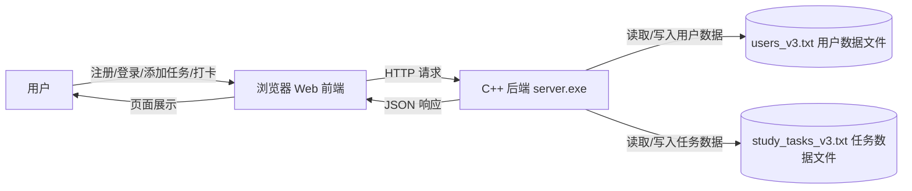

### 1.3 分层说明

| 层次 | 组成 | 主要职责 |
|---|---|---|
| 表现层 | HTML、CSS、JavaScript | 登录注册界面、任务界面、统计图表、用户交互 |
| 接口层 | HTTP API | 前端与后端之间的数据通信 |
| 业务逻辑层 | C++ 函数 | 注册、登录、任务添加、打卡、删除、提醒、统计 |
| 数据持久层 | 文本文件 | 保存用户数据和任务数据 |

### 1.4 技术选型

| 技术 | 用途 | 选择原因 |
|---|---|---|
| C++ | 后端业务逻辑 | 符合课程要求，体现 C++ 基础和数据结构能力 |
| WinSock | 本地 HTTP 服务 | Windows 环境下可用 C++ 实现网络通信 |
| HTML | 页面结构 | 简单直观，适合课程项目展示 |
| CSS | 页面样式 | 实现较美观的界面布局 |
| JavaScript | 前端交互 | 调用后端接口、渲染页面 |
| 文本文件 | 数据保存 | 难度适中，不引入数据库复杂度 |

## 2. 系统功能结构

### 2.1 功能层次结构图

```mermaid
flowchart TD
    A[学习养成计划 V3]
    A --> B[用户模块]
    A --> C[任务管理模块]
    A --> D[提醒模块]
    A --> E[打卡模块]
    A --> F[统计分析模块]
    A --> G[推荐任务模块]
    A --> H[数据存储模块]
    A --> I[前端界面模块]

    B --> B1[用户注册]
    B --> B2[用户登录]
    B --> B3[退出登录]
    B --> B4[当前用户保持]

    C --> C1[添加任务]
    C --> C2[查看任务]
    C --> C3[筛选任务]
    C --> C4[删除任务]
    C --> C5[按用户隔离任务]

    D --> D1[截止时间提醒]
    D --> D2[优先级提醒]
    D --> D3[复习提醒]

    E --> E1[完成任务]
    E --> E2[记录完成日期]
    E --> E3[生成打卡记录]
    E --> E4[生成打卡日历]

    F --> F1[总任务数统计]
    F --> F2[完成率统计]
    F --> F3[每日任务统计]
    F --> F4[主题完成率统计]
    F --> F5[优先级分布统计]

    G --> G1[获取推荐任务]
    G --> G2[采用推荐任务]

    H --> H1[保存用户文件]
    H --> H2[保存任务文件]
    H --> H3[启动时加载数据]

    I --> I1[登录注册界面]
    I --> I2[学习总览界面]
    I --> I3[任务管理界面]
    I --> I4[打卡记录界面]
    I --> I5[数据分析界面]
```

### 2.2 模块说明

| 模块 | 说明 |
|---|---|
| 用户模块 | 负责注册、登录、退出登录和当前用户状态保存 |
| 任务管理模块 | 负责添加、查看、筛选、删除学习任务 |
| 提醒模块 | 根据任务截止时间、优先级和复习规则生成提醒 |
| 打卡模块 | 用户完成任务后记录完成状态和完成日期 |
| 统计分析模块 | 统计任务总数、完成率、每日任务、主题完成率等 |
| 推荐任务模块 | 提供系统预设推荐任务，辅助用户快速添加任务 |
| 数据存储模块 | 使用文本文件保存用户和任务数据 |
| 前端界面模块 | 提供用户可操作的网页界面 |

## 3. 系统用例时序图及说明

### 3.1 用户注册时序图

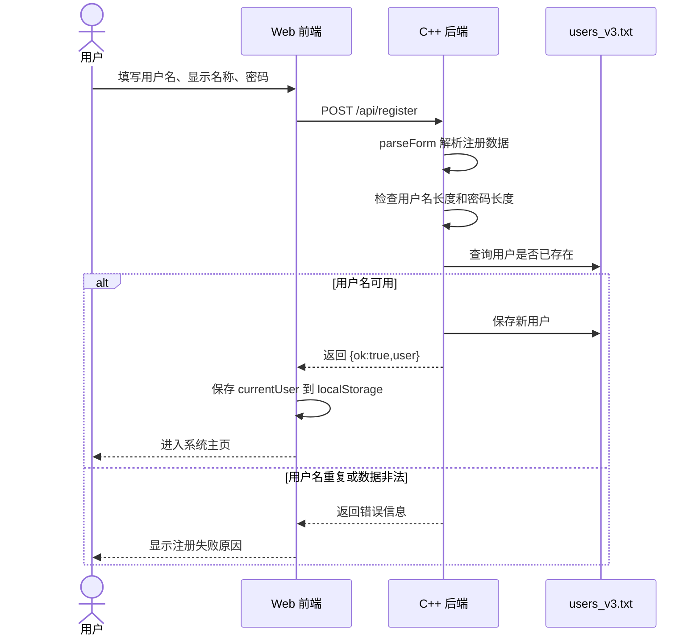

#### 说明

注册功能由前端收集用户信息，后端校验用户名和密码。注册成功后，用户信息保存到 `users_v3.txt`。前端保存当前用户信息，并进入主系统界面。

### 3.2 用户登录时序图

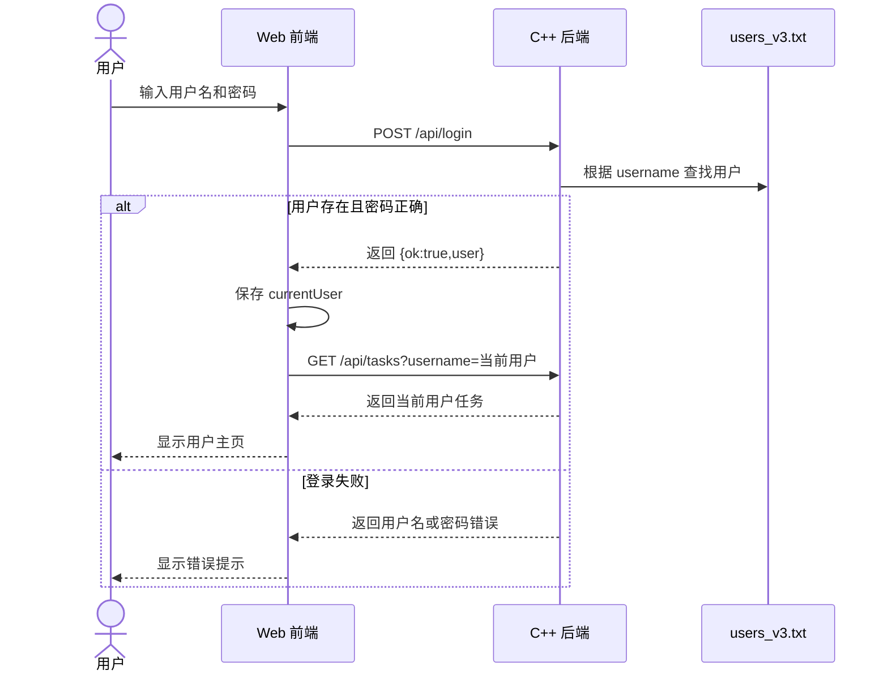

#### 说明

登录时，后端根据用户名查找用户并校验密码。登录成功后，前端将用户信息保存到浏览器 `localStorage`，之后所有任务请求都携带 username。

### 3.3 添加学习任务时序图

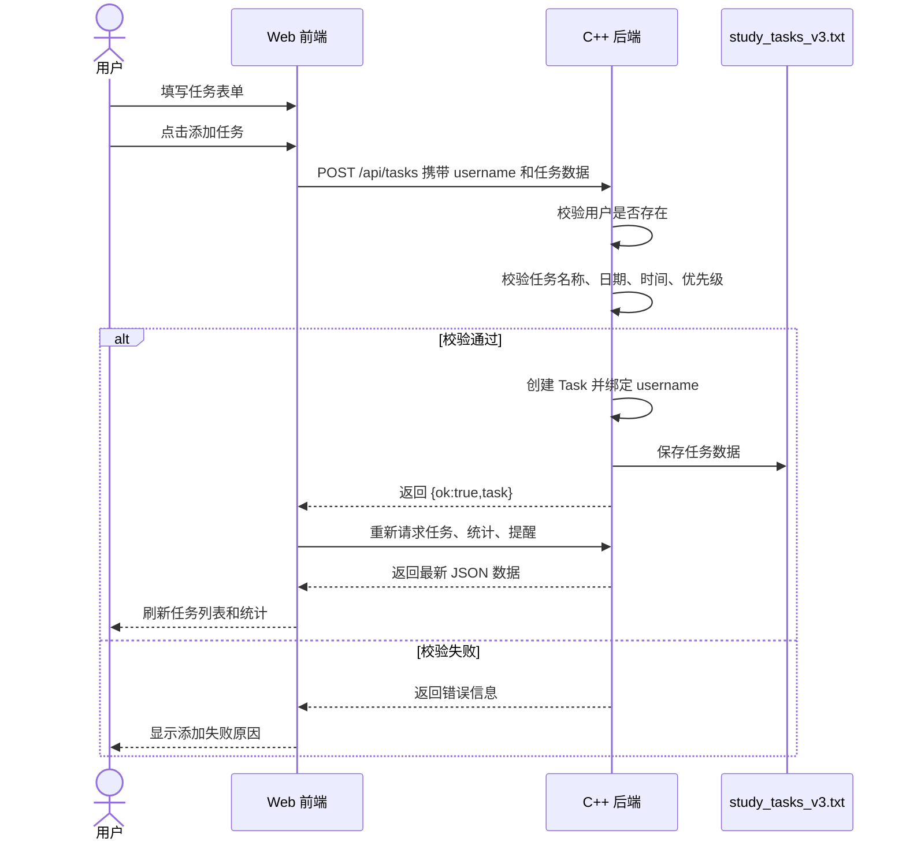

#### 说明

添加任务时，前端必须提交当前用户名。后端将任务与用户名绑定，保证任务属于当前登录用户。

### 3.4 完成任务打卡时序图

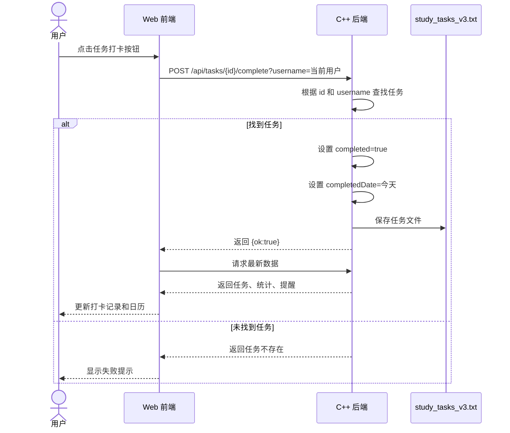

#### 说明

打卡时后端同时检查任务编号和用户名，防止一个用户操作另一个用户的任务。

### 3.5 删除任务时序图

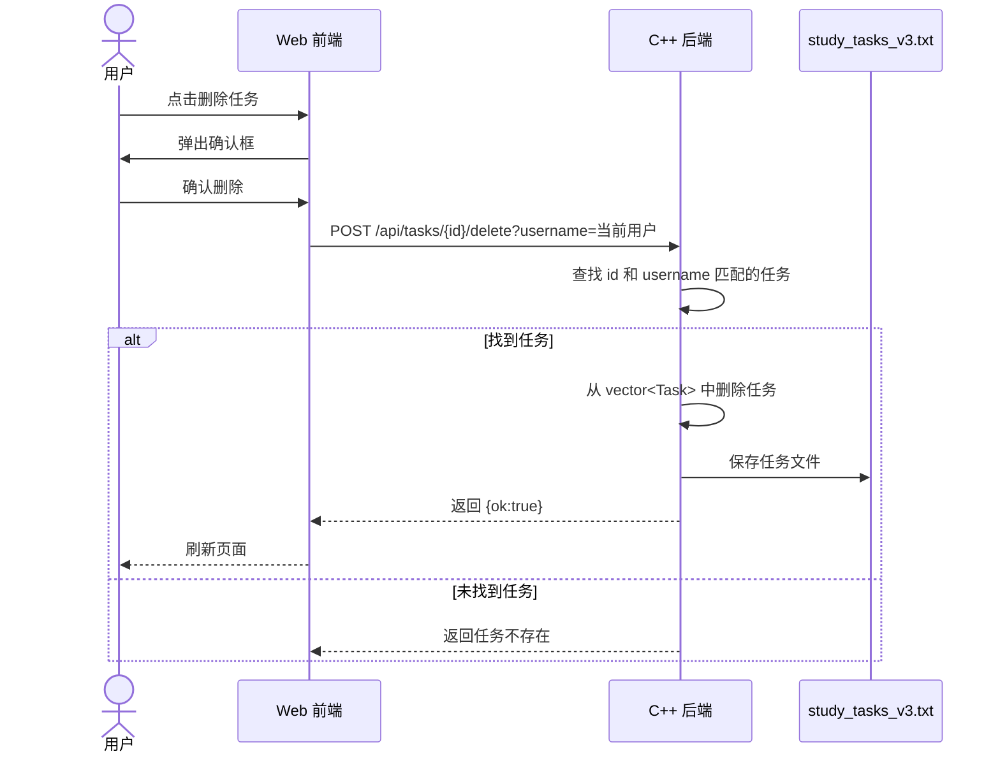

#### 说明

删除任务前，前端先进行确认。后端删除时按 `id + username` 双条件删除，保证数据隔离。

## 4. 复杂功能的算法设计

### 4.1 用户注册算法

#### 算法流程图

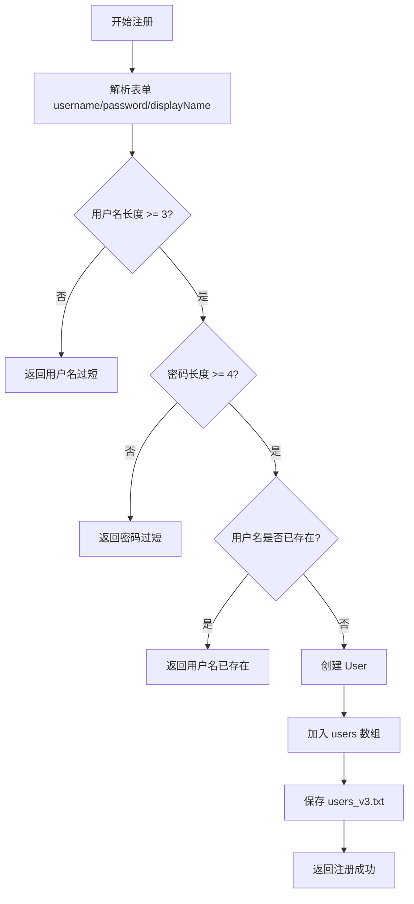

#### 伪码

```text
Register(body):
    data = parseForm(body)
    username = data["username"]
    password = data["password"]
    displayName = data["displayName"]

    if username.length < 3:
        return 失败：用户名至少 3 个字符

    if password.length < 4:
        return 失败：密码至少 4 个字符

    if findUser(username) != null:
        return 失败：用户名已存在

    user = User(username, password, displayName, todayDate)
    users.push_back(user)
    saveUsers()
    return 成功
```

### 4.2 用户登录算法

#### 算法流程图

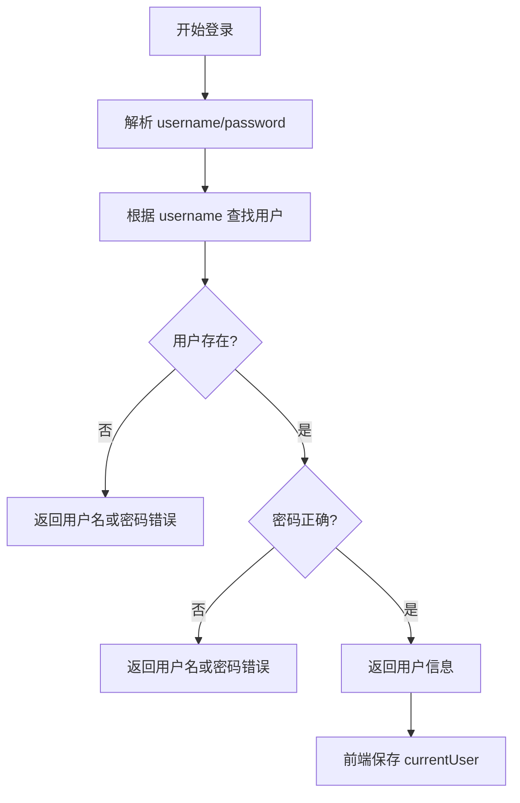

#### 伪码

```text
Login(body):
    data = parseForm(body)
    username = data["username"]
    password = data["password"]

    user = findUser(username)

    if user == null:
        return 失败

    if user.password != password:
        return 失败

    return 成功，并返回 user
```

### 4.3 按用户隔离任务算法

#### 算法流程图

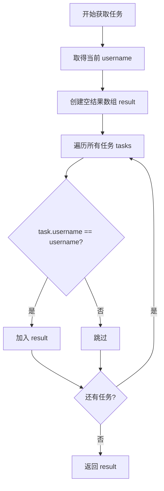

#### 伪码

```text
UserTasks(username):
    result = []
    for task in tasks:
        if task.username == username:
            result.add(task)
    return result
```

### 4.4 任务提醒算法

#### 算法流程图

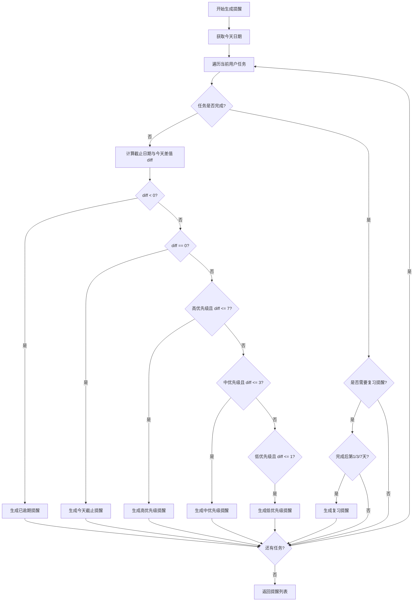

#### 伪码

```text
GenerateReminders(username):
    today = todayDate()
    reminders = []

    for task in tasks:
        if task.username != username:
            continue

        if task.completed == false:
            diff = task.dueDate - today
            if diff < 0:
                reminders.add("已逾期")
            else if diff == 0:
                reminders.add("今天截止")
            else if task.priority == 3 and diff <= 7:
                reminders.add("高优先级提醒")
            else if task.priority == 2 and diff <= 3:
                reminders.add("中优先级提醒")
            else if task.priority == 1 and diff <= 1:
                reminders.add("低优先级提醒")

        if task.completed and task.needReview:
            passed = today - task.completedDate
            if passed in [1, 3, 7]:
                reminders.add("复习提醒")

    return reminders
```

### 4.5 统计分析算法

#### 算法流程图

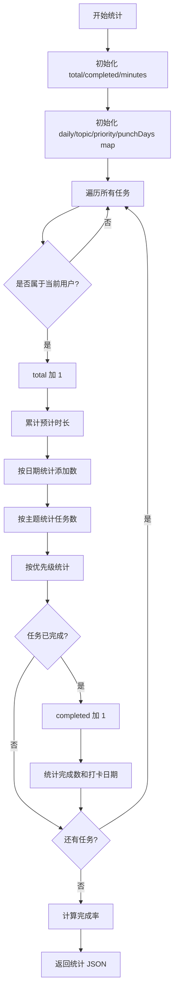

#### 伪码

```text
Stats(username):
    total = 0
    completed = 0
    minutes = 0
    daily = map
    topic = map
    priority = map
    punchDays = map

    for task in tasks:
        if task.username != username:
            continue

        total++
        minutes += task.estimatedMinutes
        daily[task.createdDate].added++
        topic[task.topic].total++
        priority[task.priority]++

        if task.completed:
            completed++
            daily[task.createdDate].done++
            topic[task.topic].done++
            punchDays[task.completedDate]++

    rate = completed / total * 100
    return JSON
```

## 5. 面向对象方法类图详细设计

### 5.1 类图 Mermaid 代码

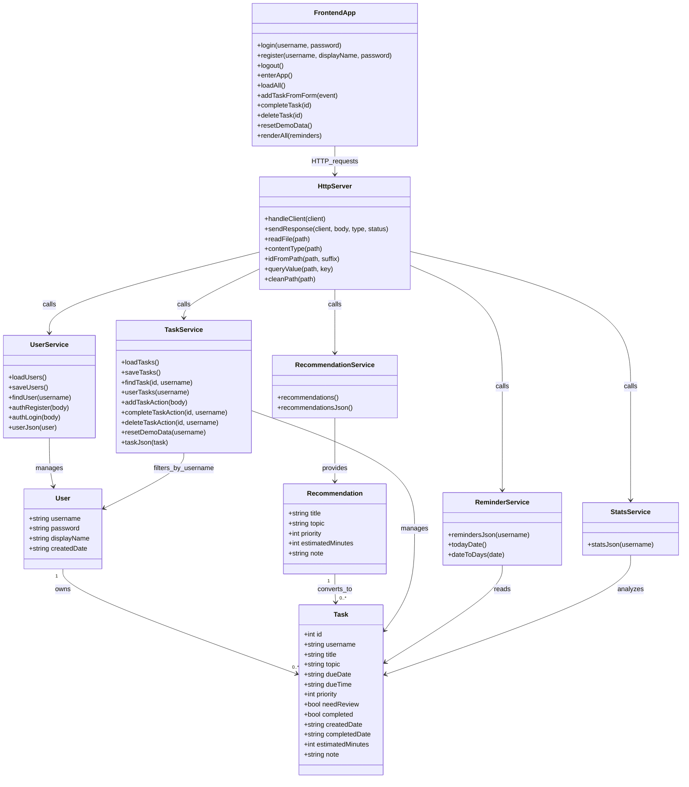

### 5.2 类来源说明

| 类名 | 来源 | 说明 |
|---|---|---|
| User | C++ `struct User` | 真实存在的数据结构，表示用户 |
| Task | C++ `struct Task` | 真实存在的数据结构，表示学习任务 |
| Recommendation | C++ `struct Recommendation` | 真实存在的数据结构，表示推荐任务 |
| UserService | 后端用户相关函数抽象 | 由 loadUsers、saveUsers、authRegister、authLogin 等函数抽象得到 |
| TaskService | 后端任务相关函数抽象 | 由 addTaskAction、completeTaskAction、deleteTaskAction 等函数抽象得到 |
| RecommendationService | 推荐任务函数抽象 | 由 recommendations、recommendationsJson 抽象得到 |
| ReminderService | 提醒函数抽象 | 由 remindersJson、dateToDays、todayDate 抽象得到 |
| StatsService | 统计函数抽象 | 由 statsJson 抽象得到 |
| HttpServer | HTTP 请求处理函数抽象 | 由 handleClient、sendResponse、readFile 等函数抽象得到 |
| FrontendApp | 前端 JS 函数抽象 | 由 app.js 中登录、注册、渲染、请求函数抽象得到 |

说明：当前 C++ 代码主要采用“结构体 + 函数”方式实现，不是真正的 class 类文件。因此类图中服务类属于设计建模抽象，用于表达职责划分。

## 6. 接口设计

### 6.1 接口总表

| 接口 | 方法 | 参数 | 返回 | 说明 |
|---|---|---|---|---|
| `/api/register` | POST | username、password、displayName | JSON | 注册用户 |
| `/api/login` | POST | username、password | JSON | 用户登录 |
| `/api/tasks?username=xxx` | GET | username | JSON 数组 | 获取当前用户任务 |
| `/api/tasks` | POST | username、任务字段 | JSON | 添加任务 |
| `/api/tasks/{id}/complete?username=xxx` | POST | id、username | JSON | 完成任务打卡 |
| `/api/tasks/{id}/delete?username=xxx` | POST | id、username | JSON | 删除任务 |
| `/api/stats?username=xxx` | GET | username | JSON | 获取当前用户统计 |
| `/api/reminders?username=xxx` | GET | username | JSON 数组 | 获取当前用户提醒 |
| `/api/recommendations` | GET | 无 | JSON 数组 | 获取推荐任务 |
| `/api/demo/reset?username=xxx` | POST | username | JSON | 生成当前用户演示数据 |

### 6.2 注册接口

请求：

```text
POST /api/register
```

提交数据：

```text
username=alice&password=1234&displayName=Alice
```

成功返回：

```json
{
  "ok": true,
  "user": {
    "username": "alice",
    "displayName": "Alice",
    "createdDate": "2026-07-07"
  }
}
```

失败返回：

```json
{
  "ok": false,
  "message": "用户名已存在"
}
```

### 6.3 登录接口

请求：

```text
POST /api/login
```

提交数据：

```text
username=alice&password=1234
```

成功返回用户信息，失败返回错误提示。

### 6.4 添加任务接口

请求：

```text
POST /api/tasks
```

提交数据：

```text
username=alice&title=复习C++&topic=C++&dueDate=2026-07-07&dueTime=20:00&priority=2&estimatedMinutes=30&needReview=true&note=复习结构体
```

说明：后端会将任务绑定到 `username=alice`。

### 6.5 统计接口

请求：

```text
GET /api/stats?username=alice
```

返回内容包括：

- total
- completed
- todo
- rate
- estimatedMinutes
- daily
- topic
- priority
- punchDays

## 7. 数据库物理设计

当前系统没有使用真正数据库，而是使用两个文本文件模拟数据库表。

### 7.1 用户文件 users_v3.txt

文件位置：

```text
backend/users_v3.txt
```

物理字段格式：

```text
username|password|displayName|createdDate
```

示例：

```text
alice|1234|Alice|2026-07-07
```

字段说明：

| 字段 | 类型 | 说明 |
|---|---|---|
| username | string | 用户名，唯一 |
| password | string | 密码，课程项目中明文保存 |
| displayName | string | 显示名称 |
| createdDate | string | 注册日期 |

### 7.2 任务文件 study_tasks_v3.txt

文件位置：

```text
backend/study_tasks_v3.txt
```

物理字段格式：

```text
id|username|title|topic|dueDate|dueTime|priority|needReview|completed|createdDate|completedDate|estimatedMinutes|note
```

示例：

```text
1|alice|复习C++|C++|2026-07-07|20:00|2|1|0|2026-07-07|-|30|复习结构体
```

字段说明：

| 字段 | 类型 | 说明 |
|---|---|---|
| id | int | 任务编号 |
| username | string | 所属用户 |
| title | string | 任务名称 |
| topic | string | 学习主题 |
| dueDate | string | 完成日期 |
| dueTime | string | 完成时间 |
| priority | int | 优先级 |
| needReview | bool/int | 1 表示需要复习，0 表示不需要 |
| completed | bool/int | 1 表示完成，0 表示未完成 |
| createdDate | string | 创建日期 |
| completedDate | string | 完成日期，未完成为 `-` |
| estimatedMinutes | int | 预计学习时长 |
| note | string | 备注 |

### 7.3 物理设计说明

系统采用文本文件保存数据，原因如下：

1. 符合当前 C++ 基础学习阶段。
2. 不需要额外安装数据库。
3. 便于查看数据格式。
4. 能体现文件读写和数据结构应用。

局限性：

1. 不适合大量数据。
2. 不适合多人同时写入。
3. 密码没有加密。
4. 后续可升级为 SQLite 或 MySQL。

## 8. UI 界面设计

### 8.1 UI 总体风格

系统采用网页界面，整体风格简洁、清晰，适合学习管理类工具。

主要特点：

1. 左侧导航栏固定功能入口。
2. 右侧展示当前功能内容。
3. 使用卡片展示任务和统计数据。
4. 使用进度条展示完成率。
5. 使用日历展示打卡情况。
6. 登录注册独立成页，避免未登录用户进入任务系统。

### 8.2 登录注册界面设计

登录注册界面包括：

- 系统名称。
- 登录/注册切换按钮。
- 用户名输入框。
- 密码输入框。
- 显示名称输入框。
- 登录或注册按钮。
- 错误提示区域。

界面目标：让用户先完成身份确认，再进入系统。

### 8.3 主界面布局

主界面分为两部分：

```text
左侧栏 + 右侧主内容区
```

左侧栏包括：

- 系统名称。
- 当前用户信息。
- 导航按钮。
- 今日提醒。
- 退出登录按钮。

右侧主内容区包括：

- 顶部日期和标题。
- 操作按钮。
- 指标卡片。
- 不同功能页面。

### 8.4 学习总览界面

总览界面展示：

1. 总任务数。
2. 已完成任务数。
3. 完成率。
4. 预计学习时长。
5. 整体进度条。
6. 优先级分布。
7. 推荐任务。

### 8.5 任务管理界面

任务管理界面包括：

1. 添加任务表单。
2. 任务筛选按钮。
3. 任务卡片列表。
4. 打卡按钮。
5. 删除按钮。

任务卡片展示：

- 任务名称。
- 主题。
- 优先级。
- 截止时间。
- 是否复习。
- 完成状态。
- 备注。

### 8.6 打卡记录界面

打卡记录界面包括：

1. 打卡日历。
2. 打卡记录表。

打卡日历中有打卡记录的日期会高亮。

### 8.7 数据分析界面

数据分析界面包括：

1. 每日任务分析。
2. 主题完成情况。
3. 进度条展示。

### 8.8 响应式设计

CSS 中使用 `@media` 实现响应式布局。

当屏幕较窄时：

1. 左右两列改为上下布局。
2. 卡片由多列改为单列。
3. 表单和任务列表适配小屏幕。

## 9. 部署与运行设计

### 9.1 开发运行

开发者运行：

```text
fullstack_v3/run_backend.bat
```

### 9.2 给同学运行

将以下文件夹复制给同学：

```text
fullstack_v3_release_给同学运行
```

同学双击：

```text
双击运行项目.bat
```

### 9.3 注意事项

1. 不要删除 frontend 文件夹。
2. 不要删除 backend/server.exe。
3. 如果 8090 端口被占用，需要关闭占用程序。
4. 如果安全软件拦截 exe，需要允许运行。

## 10. 系统设计总结

V3 在 V2 的基础上增加了完整的用户模块。系统使用 `User` 和 `Task` 两个核心数据结构，通过 `username` 字段建立用户与任务之间的关联，实现了多用户任务隔离。前端负责登录注册、任务展示和可视化，后端负责用户校验、任务保存、提醒计算和统计分析。整体设计符合课程项目要求，既体现了 C++ 基础语法和数据结构，也体现了前后端协作的软件设计思想。
