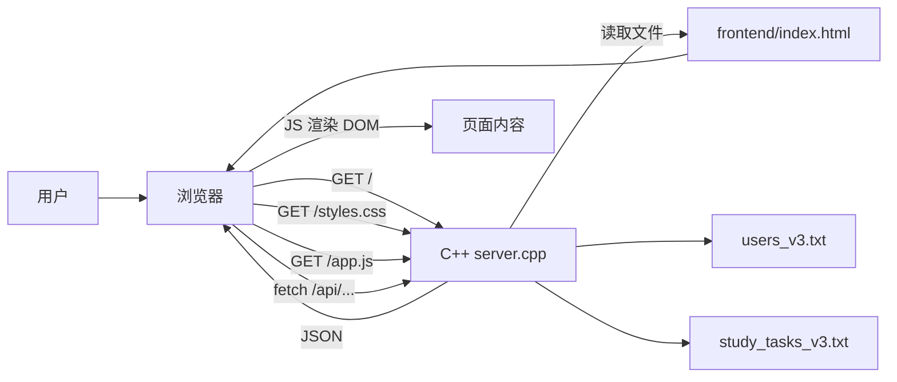

# 学习养成计划 V3：前端逐行讲解与四文件交互说明

项目位置：`D:/Yiqian_Yang _Homework_c++/project/fullstack_v3_release_给同学运行/`

四个核心文件：

- `frontend/index.html`：页面结构，负责“有什么东西”。
- `frontend/styles.css`：页面样式，负责“长什么样”。
- `frontend/app.js`：页面行为，负责“点了以后发生什么、怎么向后端要数据”。
- `backend/server.cpp`：C++ 后端，负责“存数据、处理请求、返回 JSON 或页面文件”。

一句话总览：

浏览器打开 `http://localhost:8090`，其实访问的是 C++ 后端。后端读取 `../frontend/index.html` 发给浏览器；HTML 再加载 `styles.css` 和 `app.js`；JavaScript 用 `fetch()` 请求 `/api/...` 接口；C++ 根据接口读写 `users_v3.txt` 和 `study_tasks_v3.txt`，再把 JSON 返回给前端；前端把 JSON 渲染成页面。

---

## 第一部分：前端代码从语法到作用

### 0. 先分清“本来就有”和“自己定义”

前端里大致有三类名字：

| 类型 | 例子 | 来源 |
|---|---|---|
| 浏览器内置对象/函数 | `document`、`localStorage`、`fetch`、`confirm`、`setTimeout`、`Date`、`URLSearchParams`、`Promise`、`Array.from` | 浏览器自带，不是作者写的 |
| HTML/CSS 标准属性或标签 | `<section>`、`id`、`class`、`required`、`placeholder`、`display: grid`、`@media` | HTML/CSS 语言标准自带 |
| 项目自己定义的变量/函数/class/id | `API`、`currentUser`、`tasks`、`loadAll()`、`renderTasks()`、`authView`、`.primary-btn` | 这个项目作者自己写的 |

判断方法：

- 像 `document.querySelector()` 这种通常是浏览器 API。
- 像 `function renderTasks()`、`const API = ...` 这种是作者自己定义。
- HTML 里的 `id="taskList"` 是作者给元素起名字，JavaScript 通过 `$("#taskList")` 找到它。
- CSS 里的 `.task-card` 是作者定义的样式类，HTML 写 `class="task-card"` 后就套用这个样式。

---

## A. `index.html` 逐行解析

HTML 的核心语法：

```html
<标签名 属性名="属性值">内容</标签名>
```

例如：

```html
<button id="loginTab" class="auth-tab active">登录</button>
```

意思是：创建一个按钮，按钮文字是“登录”；它的唯一编号是 `loginTab`；它使用两个 CSS 类：`auth-tab` 和 `active`。

### 1-8 行：HTML 文档头

| 行 | 代码作用 |
|---|---|
| 1 | `<!DOCTYPE html>` 告诉浏览器：这是 HTML5 页面。标准写法，固定模板。 |
| 2 | `<html lang="zh-CN">` 整个网页根标签，`lang` 表示主要语言是简体中文。 |
| 3 | `<head>` 开始页面头部。头部不直接显示内容，主要放编码、标题、样式引用。 |
| 4 | `<meta charset="UTF-8" />` 设置字符编码，保证中文不乱码。 |
| 5 | `<meta name="viewport"...>` 移动端适配，让手机宽度按设备宽度计算。 |
| 6 | `<title>学习养成计划 V3</title>` 浏览器标签页标题。 |
| 7 | `<link rel="stylesheet" href="styles.css" />` 加载 CSS 文件。`href` 指向同目录下的 `styles.css`。 |
| 8 | `</head>` 结束头部。 |

这里的 `meta`、`title`、`link` 都是 HTML 标准标签；`styles.css` 是项目里的文件名。

### 9-36 行：登录/注册页面

| 行 | 代码作用 |
|---|---|
| 9 | `<body>` 开始页面主体，真正显示在浏览器里的内容都在这里。 |
| 10 | `<section id="authView" class="auth-page">` 创建登录注册区域。`id=authView` 给 JS 控制显示/隐藏；`class=auth-page` 给 CSS 设置居中背景。 |
| 11 | `<div class="auth-card">` 卡片容器。`div` 是普通盒子。 |
| 12 | `<div class="brand auth-brand">` 品牌标题区域，同时使用 `brand` 和 `auth-brand` 两个样式类。 |
| 13 | `<div class="logo">学</div>` 蓝色 logo 方块，里面显示“学”。 |
| 14 | `<div>` 普通容器，包住标题和说明。 |
| 15 | `<h1>学习养成计划 V3</h1>` 一级标题。 |
| 16 | `<p>注册 / 登录后管理自己的学习任务</p>` 段落说明。 |
| 17-18 | 连续关闭前面打开的 `div`。HTML 标签通常成对出现。 |
| 19 | `<div class="auth-tabs">` 登录/注册切换按钮的容器。 |
| 20 | `<button id="loginTab" class="auth-tab active">登录</button>` 登录 tab。`active` 表示当前选中。JS 会通过 `id=loginTab` 绑定点击事件。 |
| 21 | `<button id="registerTab" class="auth-tab">注册</button>` 注册 tab，初始未选中。 |
| 22 | 关闭 tab 容器。 |
| 23 | `<form id="loginForm" class="auth-form">` 登录表单。`form` 天然支持提交；JS 监听它的 `submit` 事件。 |
| 24 | `<label>用户名<input id="loginUsername" required placeholder="请输入用户名" /></label>` 标签加输入框。`required` 表示必填；`placeholder` 是灰色提示；`id` 给 JS 读取值。 |
| 25 | 密码输入框，`type="password"` 会把输入内容显示成圆点。 |
| 26 | 登录提交按钮，`type="submit"` 表示点击会提交表单。 |
| 27 | 关闭登录表单。 |
| 28 | `<form id="registerForm" class="auth-form hidden">` 注册表单。`hidden` 是项目 CSS 类，初始隐藏。 |
| 29 | 注册用户名输入框。 |
| 30 | 显示名称/昵称输入框，不写 `required`，所以可选。 |
| 31 | 注册密码输入框。 |
| 32 | 注册提交按钮。 |
| 33 | 关闭注册表单。 |
| 34 | `<p id="authMessage" class="auth-message"></p>` 登录/注册错误提示区域，初始为空，JS 会写入文字。 |
| 35 | 关闭卡片。 |
| 36 | 关闭登录注册区域。 |

重点：`id` 是 JavaScript 找元素用的；`class` 是 CSS 设样式用的，也会被 JS 用来切换显示状态。

### 38-62 行：登录后的左侧侧边栏

| 行 | 代码作用 |
|---|---|
| 38 | `<div id="appView" class="app hidden">` 主应用区域。初始隐藏，登录后 JS 移除 `hidden`。 |
| 39 | `<aside class="sidebar">` 左侧栏。`aside` 表示辅助区域。 |
| 40-46 | 品牌区，和登录页类似；`id="userLabel"` 会显示“当前用户：xxx”。 |
| 47 | `<nav class="nav">` 导航栏。`nav` 是语义标签，表示导航。 |
| 48 | 总览按钮：`data-view="dashboard"` 是自定义数据属性，JS 读它决定切换到哪个页面。 |
| 49 | 任务按钮，`data-view="tasks"`。 |
| 50 | 打卡按钮，`data-view="records"`。 |
| 51 | 分析按钮，`data-view="analysis"`。 |
| 52 | 关闭导航。 |
| 53 | `<section class="side-card">` 今日提醒卡片。 |
| 54 | 卡片标题。 |
| 55 | `<div id="reminderList"...>` 提醒列表容器，JS 把后端返回的提醒插入这里。 |
| 56 | 关闭提醒卡片。 |
| 57 | 账号卡片，额外有 `compact` 样式。 |
| 58 | 标题“账号”。 |
| 59 | `<p id="serverState"...>` 显示当前账号。 |
| 60 | `<button id="logoutBtn"...>` 退出登录按钮，JS 绑定点击事件。 |
| 61-62 | 关闭账号卡片和侧边栏。 |

`data-view` 不是浏览器固定要求的属性，而是 HTML 允许作者自定义的 `data-*` 属性。JS 里通过 `button.dataset.view` 读取。

### 64-81 行：主区域标题和四个统计卡片

| 行 | 代码作用 |
|---|---|
| 64 | `<main class="main">` 主内容区域。 |
| 65 | `<header class="hero">` 页面顶部标题栏。这里叫 `hero`，但不是传统营销页大图，只是项目作者命名。 |
| 67 | `<p id="todayLabel"...>` 今天日期，JS 初始化时填入。 |
| 68 | `<h2 id="pageTitle">学习总览</h2>` 当前页面标题，切换导航时 JS 改文字。 |
| 70 | `<div class="hero-actions">` 顶部按钮容器。 |
| 71 | 生成演示数据按钮，JS 绑定 `resetDemoData()`。 |
| 72 | 刷新按钮，JS 绑定 `loadAll()`。 |
| 74 | 关闭 header。 |
| 76 | `<section class="metric-grid">` 四个统计卡片的网格容器。 |
| 77 | 总任务卡片，`id="totalCount"` 是 JS 写入数字的位置。 |
| 78 | 已完成卡片，`id="doneCount"`。 |
| 79 | 完成率卡片，`id="rateCount"`。 |
| 80 | 预计时长卡片，`id="minuteCount"`。 |
| 81 | 关闭统计网格。 |

这一段里的 `<article>` 表示一块独立内容；`<span>`、`<strong>`、`<small>` 是文本标签，分别用于普通小文本、强调数字、辅助说明。

### 83-95 行：总览视图

| 行 | 代码作用 |
|---|---|
| 83 | `<section id="dashboardView" class="view active">` 总览页面。`view` 表示一个可切换视图，`active` 表示当前显示。 |
| 84 | `dashboard-grid` 是布局容器。 |
| 85 | 左侧大面板。 |
| 86 | 面板标题“整体进度”，`progressHint` 显示“已完成 x/y”。 |
| 87 | 进度条外壳 `big-progress`，里面 `id="mainProgress"` 的 div 会被 JS 改宽度。 |
| 88 | `priorityBars` 用来显示高/中/低优先级柱状条。 |
| 90-93 | 快捷添加面板，`recommendList` 由 JS 渲染推荐任务。 |
| 94-95 | 关闭网格和总览视图。 |

### 97-126 行：任务管理视图

| 行 | 代码作用 |
|---|---|
| 97 | `<section id="tasksView" class="view">` 任务页。没有 `active`，所以初始隐藏。 |
| 98 | `editor-grid` 两栏布局：左侧表单，右侧列表。 |
| 99 | `<form id="taskForm"...>` 添加任务表单。 |
| 100 | 面板标题。 |
| 101 | 任务名称输入框，JS 读取 `titleInput.value`。 |
| 102 | 学习主题输入框。 |
| 103 | `two-col` 两列容器。 |
| 104 | 日期输入，`type="date"` 浏览器会显示日期选择器。 |
| 105 | 时间输入，`type="time"` 浏览器会显示时间选择器。 |
| 107 | 第二个两列容器。 |
| 108 | 优先级下拉框，`select` 里有三个 `option`；值是 `3/2/1`，显示文字是高/中/低。 |
| 109 | 预计时长，`type="number"` 表示数字输入；`min/max/value` 是最小、最大、默认值。 |
| 111 | 备注，`textarea` 是多行文本框。 |
| 112 | 复选框，`type="checkbox"`；JS 用 `checked` 判断是否勾选。 |
| 113 | 添加任务按钮，提交表单。 |
| 114 | 关闭任务表单。 |
| 115-116 | 右侧任务筛选面板开始。 |
| 117 | 筛选按钮容器。 |
| 118-121 | 四个筛选按钮，靠 `data-filter` 告诉 JS 当前筛选条件。 |
| 123 | `taskList` 是任务卡片列表容器，JS 动态生成。 |
| 124-126 | 关闭面板、布局和任务视图。 |

### 128-146 行：打卡记录和分析视图

| 行 | 代码作用 |
|---|---|
| 128 | `<section id="recordsView" class="view">` 打卡记录页。 |
| 129 | `records-grid` 两栏布局。 |
| 131 | 月份输入框 `type="month"`，选择某年某月；JS 重新渲染日历。 |
| 132 | `calendar` 容器，JS 生成日历格子。 |
| 135-136 | 打卡记录表格。`thead` 是表头，`tbody id="recordTable"` 由 JS 填充。 |
| 141 | `<section id="analysisView" class="view">` 数据分析页。 |
| 143 | 每日任务分析容器 `dailyStats`。 |
| 144 | 主题完成情况容器 `topicStats`。 |
| 146 | 关闭分析视图。 |

### 147-152 行：结尾和加载 JavaScript

| 行 | 代码作用 |
|---|---|
| 147-148 | 关闭 `main` 和 `appView`。 |
| 149 | `<div id="toast" class="toast"></div>` 浮动提示框，JS 写文字并显示。 |
| 150 | `<script src="app.js"></script>` 加载 JavaScript 文件。放在 body 末尾的好处：前面的 HTML 元素已经存在，JS 可以直接找到它们。 |
| 151 | 关闭 body。 |
| 152 | 关闭 html。 |

---

## B. `styles.css` 逐段逐行解析

CSS 的基本语法：

```css
选择器 {
  属性名: 属性值;
}
```

例如：

```css
.primary-btn {
  background: var(--blue);
  color: #fff;
}
```

意思是：所有 `class="primary-btn"` 的元素，背景色用蓝色变量，文字白色。

### 1-14 行：全局颜色变量

| 行 | 代码作用 |
|---|---|
| 1 | `:root` 选择整个页面的根元素。常用来定义全局 CSS 变量。 |
| 2-12 | `--bg`、`--surface` 等是作者自定义 CSS 变量。变量名必须以 `--` 开头。 |
| 13 | `--shadow` 定义阴影效果。`rgba` 是带透明度的颜色。 |
| 14 | 结束 `:root`。 |

使用变量的方法是 `var(--blue)`。例如第 22 行背景色就是 `var(--blue)`。

### 15-18 行：基础重置

| 行 | 代码作用 |
|---|---|
| 15 | `*` 选中所有元素；`box-sizing: border-box` 让宽高计算更直观。 |
| 16 | 设置 body：去掉默认外边距、最小高度一屏、文字颜色、背景色、字体。 |
| 17 | 让按钮、输入框、下拉框、文本框继承 body 字体。 |
| 18 | 鼠标放到按钮上显示手形。 |

### 19-46 行：整体布局、侧边栏、按钮

| 行 | 代码作用 |
|---|---|
| 19 | `.app` 主应用容器：最小高度一屏，使用 CSS Grid，左栏 304px，右侧占剩余空间。 |
| 20 | `.sidebar` 左侧栏：白底、右边框、内边距、竖向 flex 布局、间距 22px。 |
| 21 | `.brand` 品牌区：横向排列、垂直居中、间距 12px。 |
| 22 | `.logo`：固定 48x48，蓝底白字，用 grid 居中文字。 |
| 23 | 去掉标题和段落默认 margin。 |
| 24 | 设置 h1 字号。 |
| 25 | `.brand p` 和 `.subtle` 小字灰色。 |
| 26 | `.nav` 使用 grid，让导航按钮纵向排列。 |
| 27 | `.nav-item` 导航按钮基础样式：无边框、透明背景、灰色文字、圆角、内边距、左对齐。 |
| 28 | 鼠标悬停或 active 时变浅蓝背景、蓝字、加粗。 |
| 29 | `.side-card`、`.panel`、`.metric-card` 共用卡片样式。逗号表示多个选择器共用规则。 |
| 30 | `.side-card` 内边距 16px。 |
| 31 | `.side-card.compact` 表示同时有 `side-card` 和 `compact` 两个 class 的元素，去掉阴影。 |
| 32 | `.side-title` 标题加粗，下方留空。 |
| 33 | `.reminder-list` 用 grid 排列提醒。 |
| 34 | `.reminder` 提醒项：左侧蓝条、浅底、圆角、内边距、字号和行高。 |
| 35 | `.server-state` 账号状态灰色。 |
| 36-37 | 如果额外加 `ok` 或 `bad` 类，就变绿或红。但当前 JS 没有实际使用这两个类。 |
| 38 | `.main` 主内容区内边距 26px，内容超出时可滚动。 |
| 39 | `.hero` 顶部栏：横向排列，两边分布。 |
| 40 | hero 中的 h2 字号 28px。 |
| 41 | `.hero-actions` 按钮横排，允许换行。 |
| 42 | 四类按钮/筛选按钮共用无边框、圆角、加粗。 |
| 43 | `.primary-btn` 蓝底白字。 |
| 44 | `.ghost-btn`、`.small-btn`、`.filter` 浅灰背景深色字。 |
| 45 | `.small-btn.done` 打卡按钮绿色风格。 |
| 46 | `.small-btn.delete` 删除按钮红色风格。 |

### 47-78 行：统计卡片、视图切换、列表元素

| 行 | 代码作用 |
|---|---|
| 47 | `.metric-grid` 四列网格，每列最小 150px，平均分剩余空间。 |
| 48 | `.metric-card` 内边距、相对定位、隐藏溢出。 |
| 49-51 | 统计卡片里的小字、数字、说明文字样式。 |
| 52 | `.metric-card::after` 伪元素：在卡片右上角画一个半透明色块。 |
| 53-56 | 不同 accent 类给伪元素不同颜色。 |
| 57 | `.view` 默认不显示。 |
| 58 | `.view.active` 显示。JS 切换 active 就是在切换页面。 |
| 59 | 四种 grid 容器共用 grid 和间距。 |
| 60 | 总览页两列比例布局。 |
| 61 | 任务页左侧表单最大 430px，右侧占剩余。 |
| 62 | 打卡页和分析页两列布局。 |
| 63 | `.panel` 面板内边距。 |
| 64 | `.large-panel` 最小高度 280px。 |
| 65 | `.panel-head` 标题栏横向排列，两端对齐。 |
| 66 | `.big-progress` 进度条外壳。 |
| 67 | `.big-progress div` 进度条内部绿色填充，JS 改它的 `width`。 |
| 68 | 多种列表容器共用 grid 和间距。 |
| 69 | 多种卡片项共用边框、圆角、白底、内边距。 |
| 70 | `.mini-row` 小柱状条一行三列：名称、条、数字。 |
| 71 | `.mini-track` 等是进度条背景。 |
| 72 | `.mini-fill` 等是进度条填充。 |
| 73 | 推荐任务卡片：左侧内容，右侧按钮。 |
| 74 | `.meta` 标签组：横向、可换行。 |
| 75 | `.badge` 小标签胶囊样式。 |
| 76-78 | 高/中/低优先级 badge 的颜色。 |

### 79-111 行：表单、任务卡片、日历、表格、Toast

| 行 | 代码作用 |
|---|---|
| 79 | 所有 `form` 使用 grid 布局，子项间距 13px。 |
| 80 | `label` 使用 grid，让文字和输入框上下排列。 |
| 81 | 输入框/下拉框/文本框统一边框、圆角、内边距、宽度。 |
| 82 | `textarea` 允许垂直拖动改变高度。 |
| 83 | `.two-col` 两列布局。 |
| 84 | `.check-row` 复选框和文字横向排列。 |
| 85 | 复选框固定 18x18。 |
| 86 | `.filter-row` 筛选按钮横排、可换行。 |
| 87 | `.filter.active` 选中的筛选按钮蓝底白字。 |
| 88 | `.task-card` 任务卡片左内容右操作按钮。 |
| 89 | `.task-card.done` 已完成任务透明度降低。 |
| 90 | `.task-title` 任务标题加粗。 |
| 91 | `.task-note` 备注文字灰色，顶部留空。 |
| 92 | `.actions` 操作按钮横排。 |
| 93 | `.calendar` 7 列网格，对应一周 7 天。 |
| 94 | 日历标题和日期格子的基础样式。 |
| 95 | 星期名称灰色加粗。 |
| 96 | 普通日期格子浅底和边框。 |
| 97 | 有打卡记录的日期格子绿色。 |
| 98 | 空白占位格隐藏，但仍占位置，保证日历对齐。 |
| 99 | `.table-wrap` 表格横向溢出时可滚动。 |
| 100 | 表格宽度 100%，边框合并。 |
| 101 | 单元格内边距、底边框、左对齐。 |
| 102 | 表头浅底。 |
| 103-105 | 统计卡片和主题卡片布局。 |
| 106 | `.toast` 固定在右下角，默认下移并透明。 |
| 107 | `.toast.show` 显示 toast。JS 添加/删除 `show` 类。 |
| 108-110 | `@media` 响应式规则：屏幕变窄时改成单列、缩小间距。 |
| 111 | 空行。 |

### 112-134 行：登录页样式

| 行 | 代码作用 |
|---|---|
| 112 | `.auth-page` 登录页容器开始。 |
| 113 | 最小高度一屏。 |
| 114-115 | 用 grid 把登录卡片水平垂直居中。 |
| 116 | 页面内边距。 |
| 117 | 登录页背景渐变。 |
| 118 | 结束 `.auth-page`。 |
| 119-126 | `.auth-card` 登录卡片：宽度、白底、边框、圆角、阴影、内边距。 |
| 127 | `.auth-brand` 下方留 20px。 |
| 128 | `.auth-tabs` 两列布局。 |
| 129 | `.auth-tab` 登录/注册 tab 基础样式。 |
| 130 | `.auth-tab.active` 选中 tab 蓝底白字。 |
| 131 | `.auth-form` 表单布局。 |
| 132 | `.auth-message` 错误信息区域，红色。 |
| 133 | `.hidden { display: none !important; }` 强制隐藏。JS 经常添加/移除这个类。 |
| 134 | `.full-btn` 宽度 100%，顶部间距 12px。 |

---

## C. `app.js` 逐行解析

JavaScript 负责把页面“活起来”。

### 1-9 行：接口地址表

```js
const API = {
  register: "/api/register",
  login: "/api/login",
  tasks: "/api/tasks",
  stats: "/api/stats",
  reminders: "/api/reminders",
  recommendations: "/api/recommendations",
  resetDemo: "/api/demo/reset"
};
```

- `const`：声明常量，变量名不能重新指向另一个对象。
- `API`：作者自己定义的对象，集中保存后端接口路径。
- `{ key: value }`：对象字面量。
- `"/api/login"` 这种路径会发给当前网站的后端，也就是 `localhost:8090/api/login`。

### 11-15 行：页面状态变量

| 行 | 代码作用 |
|---|---|
| 11 | `let currentUser = null;` 当前登录用户。`let` 表示变量之后可以改。`null` 表示现在没有用户。 |
| 12 | `let tasks = [];` 当前用户任务列表。`[]` 是数组。 |
| 13 | `let stats = {...};` 当前统计数据的默认值。对象里有数字和数组。 |
| 14 | `let recommendations = [];` 推荐任务列表。 |
| 15 | `let currentFilter = "all";` 当前任务筛选条件，默认全部。 |

这些都是作者自己定义的全局状态变量。

### 17-18 行：查询 HTML 元素的快捷函数

```js
const $ = selector => document.querySelector(selector);
const $$ = selector => Array.from(document.querySelectorAll(selector));
```

- `$` 和 `$$` 是作者自己定义的函数名。
- `selector => ...` 是箭头函数，意思类似 `function(selector) { return ... }`。
- `document.querySelector(selector)` 是浏览器内置函数，按 CSS 选择器找第一个元素。
- `document.querySelectorAll(selector)` 找所有元素。
- `Array.from(...)` 把类数组结果转成真正数组，方便用 `.forEach()`、`.map()`。

例如 `$("#authView")` 等于 `document.querySelector("#authView")`，找 `id="authView"` 的元素。

### 20-65 行：把页面元素集中保存到 `el`

```js
const el = {
  authView: $("#authView"),
  appView: $("#appView"),
  ...
};
```

- `el` 是作者定义的对象，用来存页面元素。
- `authView` 是作者起的属性名。
- `$("#authView")` 返回真实 DOM 元素。

好处：后面不用每次都写 `document.querySelector("#taskList")`，直接写 `el.taskList`。

例子：

- `el.loginUsername.value` 读取登录用户名输入框的值。
- `el.taskList.innerHTML = ...` 改任务列表区域的 HTML。
- `el.toast.classList.add("show")` 给 toast 加一个 CSS 类。

### 67-71 行：工具函数

| 行 | 代码作用 |
|---|---|
| 67 | `today()` 返回今天日期字符串，比如 `2026-07-09`。`new Date()` 是内置日期对象，`toISOString()` 转 ISO 字符串，`slice(0,10)` 截取前 10 位。 |
| 68 | `monthNow()` 返回当前年月，比如 `2026-07`。 |
| 69 | `priorityClass(priority)` 把数字优先级转成 CSS 类名：3 -> `high`，2 -> `middle`，1 -> `low`。 |
| 70 | `priorityName(priority)` 把数字转中文：高/中/低。 |
| 71 | `userQuery()` 如果已登录，返回 `?username=xxx`；否则返回空字符串。`encodeURIComponent` 是浏览器内置函数，防止用户名里有特殊字符。 |

### 73-77 行：显示浮动提示

```js
function showToast(message) {
  el.toast.textContent = message;
  el.toast.classList.add("show");
  setTimeout(() => el.toast.classList.remove("show"), 1800);
}
```

- `function showToast(message)`：作者定义函数，参数是要显示的文字。
- `textContent`：浏览器 DOM 属性，设置纯文本。
- `classList.add("show")`：给元素加 CSS 类，于是 `.toast.show` 生效，提示框出现。
- `setTimeout(..., 1800)`：浏览器内置定时器，1800 毫秒后执行函数。
- `() => ...`：无参数箭头函数。

### 79-95 行：封装后端请求

```js
async function getJson(url) {
  const response = await fetch(url);
  if (!response.ok) throw new Error("后端请求失败");
  return response.json();
}
```

- `async function`：异步函数，里面可以用 `await`。
- `fetch(url)`：浏览器内置网络请求函数。
- `await`：等待 Promise 完成。
- `response.ok`：HTTP 状态码是否 200-299。
- `throw new Error(...)`：抛出错误，交给外层 `try/catch`。
- `response.json()`：把后端返回的 JSON 字符串解析成 JS 对象/数组。

`postForm(url, data = {})`：

- `data = {}` 表示默认参数，没传 data 时用空对象。
- `new URLSearchParams()` 是内置类，用来拼表单格式数据。
- `Object.entries(data)` 把对象变成 `[key, value]` 数组。
- `.forEach(([key, value]) => ...)` 遍历每个键值对。
- `fetch(url, { method:"POST", headers:{...}, body:... })` 用 POST 方式提交。
- `Content-Type: application/x-www-form-urlencoded` 表示提交格式像 `username=a&password=b`。

### 97-104 行：切换登录/注册表单

```js
function switchAuthMode(mode) {
  const isLogin = mode === "login";
  ...
}
```

- `mode === "login"` 是严格相等判断。
- `classList.toggle("active", isLogin)`：第二个参数为 true 就加类，为 false 就删类。
- 登录模式时：登录 tab active，注册 tab 不 active，登录表单显示，注册表单隐藏。
- 注册模式时反过来。

### 106-115 行：保存/读取当前用户

| 行 | 代码作用 |
|---|---|
| 106 | 定义 `saveCurrentUser(user)`。 |
| 107 | 把全局变量 `currentUser` 设成登录成功返回的用户对象。 |
| 108 | `localStorage.setItem(...)` 把用户信息存进浏览器本地存储。`JSON.stringify(user)` 把对象转成字符串。 |
| 111 | 定义 `readCurrentUser()`。 |
| 112 | 从本地存储读字符串。 |
| 113 | 如果没有存过，返回 `null`。 |
| 114 | `try/catch`：尝试 `JSON.parse(raw)` 把字符串转回对象；如果失败就返回 `null`。 |

注意：这里保存的只是“当前登录状态”，真正账号数据存在后端 `users_v3.txt`。

### 117-135 行：登录和注册

登录流程：

```js
async function login(username, password) {
  const result = await postForm(API.login, { username, password });
  if (!result.ok) {
    el.authMessage.textContent = result.message || "登录失败";
    return;
  }
  saveCurrentUser(result.user);
  enterApp();
}
```

- 调 `POST /api/login`。
- 后端返回形如 `{ ok: true, user: {...} }` 或 `{ ok:false, message:"..." }`。
- `||` 表示“如果前面没有值，就用后面默认值”。
- 成功后保存用户并进入应用。

注册流程同理，只是调用 `POST /api/register`，提交 `username/displayName/password`。

### 137-152 行：退出和进入应用

| 行 | 代码作用 |
|---|---|
| 137 | 定义 `logout()`。 |
| 138 | 删除本地存储里的登录用户。 |
| 139-140 | 清空当前用户和任务数组。 |
| 141 | 主应用加 `hidden`，隐藏。 |
| 142 | 登录页移除 `hidden`，显示。 |
| 143 | 切回登录模式。 |
| 146 | 定义 `enterApp()`。 |
| 147-148 | 登录页隐藏，主应用显示。 |
| 149 | 顶部用户标签显示昵称或用户名。模板字符串 `${...}` 会把变量填进字符串。 |
| 150 | 账号状态显示用户名。 |
| 151 | `await loadAll()` 加载任务、统计、提醒、推荐。 |

### 154-170 行：一次性加载所有数据

```js
const [taskData, statData, reminderData, recommendationData] = await Promise.all([
  getJson(API.tasks + userQuery()),
  getJson(API.stats + userQuery()),
  getJson(API.reminders + userQuery()),
  getJson(API.recommendations)
]);
```

- `Promise.all([...])` 同时发多个请求，全部完成后继续。
- 数组解构：把四个返回值分别放进四个变量。
- `API.tasks + userQuery()` 例如变成 `/api/tasks?username=alice`。
- 任务、统计、提醒都按当前用户查；推荐任务不需要用户。

成功后：

- `tasks = taskData;`
- `stats = statData;`
- `recommendations = recommendationData;`
- `renderAll(reminderData);`

失败后：

- 在任务列表区域显示“无法连接 C++ 后端”。

### 172-190 行：添加任务

```js
async function addTaskFromForm(event) {
  event.preventDefault();
  const result = await postForm(API.tasks, {
    username: currentUser.username,
    title: el.titleInput.value.trim(),
    ...
  });
}
```

- `event` 是浏览器传给事件处理函数的事件对象。
- `preventDefault()` 阻止表单默认刷新页面。
- `.value` 读取输入框值。
- `.trim()` 去掉首尾空格。
- `el.reviewInput.checked ? "true" : "false"` 是三元表达式：勾选就传 `"true"`，否则传 `"false"`。
- 成功后 `reset()` 清空表单，`setDefaultInputs()` 恢复默认日期时间，`loadAll()` 重新加载页面数据。

### 192-210 行：打卡、删除、生成演示数据

| 行 | 代码作用 |
|---|---|
| 192 | `completeTask(id)` 接收任务 id。 |
| 193 | 请求 `/api/tasks/{id}/complete?username=xxx`。反引号字符串里的 `${id}` 会替换成真实 id。 |
| 194-195 | 成功提示，然后重新加载。 |
| 198 | `deleteTask(id)` 删除任务。 |
| 199 | `confirm(...)` 是浏览器确认框；点取消就 `return` 结束。 |
| 200 | 请求 `/api/tasks/{id}/delete?username=xxx`。 |
| 205 | `resetDemoData()` 生成演示数据。 |
| 206 | 先确认会覆盖当前账号任务。 |
| 207 | 请求 `/api/demo/reset?username=xxx`。 |
| 208-209 | 提示并刷新。 |

### 212-220 行：统一渲染入口

`renderAll(reminders)` 只是把各个渲染函数按顺序调用：

- `renderMetrics()`：顶部统计。
- `renderReminders(reminders)`：左侧提醒。
- `renderRecommendations()`：推荐任务。
- `renderTasks()`：任务列表。
- `renderRecords()`：打卡表格。
- `renderCalendar()`：日历。
- `renderAnalysis()`：分析图表。

### 222-234 行：渲染统计卡片和优先级条

- `textContent` 设置纯文本。
- `style.width = ...` 直接修改元素内联样式，让进度条变长。
- `Math.max(1, ...stats.priority.map(...))` 找最大数量，至少为 1，避免除以 0。
- `.map(item => {...}).join("")` 是前端常见模板写法：数组每一项生成一段 HTML，最后拼成一个字符串。
- 反引号 `` `...${变量}...` `` 是模板字符串。

### 236-246 行：渲染提醒和推荐任务

- `reminders.length ? A : B` 是三元表达式：有提醒就渲染提醒列表，没有就显示默认文案。
- 推荐任务的按钮写了 `data-recommend="${index}"`，后面点击时 JS 能知道点的是第几个推荐。
- `${priorityClass(item.priority)}` 把数字优先级变成 CSS 类。

### 248-263 行：筛选和渲染任务列表

`filteredTasks()`：

- `tasks.filter(task => !task.completed)` 返回未完成任务。
- `tasks.filter(task => task.completed)` 返回已完成任务。
- `tasks.filter(task => task.priority === 3)` 返回高优先级任务。
- 默认返回全部。

`renderTasks()`：

- 如果没有任务，显示“暂无任务”。
- 否则把每个任务渲染成 `<article class="task-card">`。
- 已完成任务额外加 `done` 类：`${task.completed ? "done" : ""}`。
- 打卡按钮带 `data-complete="${task.id}"`。
- 删除按钮带 `data-delete="${task.id}"`。
- 如果任务已完成，打卡按钮加 `disabled` 禁用。

### 265-289 行：渲染记录、日历、分析

`renderRecords()`：

- `tasks.filter(task => task.completed)` 取已完成任务。
- `.sort((a,b) => b.completedDate.localeCompare(a.completedDate))` 按完成日期倒序。
- 生成表格行 `<tr><td>...</td></tr>`。

`renderCalendar()`：

- `el.monthInput.value || monthNow()`：用户选了月份就用用户选的，否则用当前月份。
- `value.split("-").map(Number)` 把 `"2026-07"` 变成 `[2026, 7]`。
- `new Date(year, month - 1, 1).getDay()` 得到本月 1 号是星期几。
- `new Date(year, month, 0).getDate()` 得到本月总天数。
- `new Map()` 用来保存某一天打卡几次。
- `cells.push(...)` 不断往数组里加 HTML 字符串。
- 最后 `el.calendar.innerHTML = cells.join("")` 显示日历。

`renderAnalysis()`：

- 根据后端统计的 `stats.daily` 渲染每日完成率。
- 根据 `stats.topic` 渲染主题完成率。
- 进度条宽度仍然用 `style="width:${item.rate}%"`。

### 291-316 行：采用推荐、切换页面、设置默认输入

`useRecommendation(index)`：

- 从 `recommendations[index]` 取推荐任务。
- 把推荐任务的标题、主题、优先级、时长、备注填进表单。
- `String(item.priority)` 把数字转字符串，因为 select 的 value 是字符串。
- `el.reviewInput.checked = item.priority >= 2`：中/高优先级默认勾选复习。
- `switchView("tasks")` 切到任务页。

`switchView(viewName)`：

- 所有导航按钮根据 `data-view` 切换 active。
- 所有 `.view` 先移除 active。
- `$(`#${viewName}View`)` 找到对应页面，比如 `tasks` -> `#tasksView`。
- `titleMap` 是映射对象，把内部页面名转中文标题。

`setDefaultInputs()`：

- 默认日期是今天。
- 默认时间是 20:00。
- 默认优先级是中。
- 默认时长是 30 分钟。

### 318-339 行：绑定事件和页面初始化

`bindEvents()` 把“用户动作”和“函数”连起来：

- 点登录 tab -> `switchAuthMode("login")`
- 点注册 tab -> `switchAuthMode("register")`
- 提交登录表单 -> 阻止刷新，调用 `login(...)`
- 提交注册表单 -> 调用 `register(...)`
- 点退出 -> `logout`
- 提交任务表单 -> `addTaskFromForm`
- 点刷新 -> `loadAll()` 然后提示
- 点生成演示数据 -> `resetDemoData`
- 改月份 -> `renderCalendar`
- 点推荐任务里的“采用” -> 根据 `data-recommend` 调 `useRecommendation`
- 点任务列表里的“打卡/删除” -> 根据 `data-complete` 或 `data-delete` 调相应函数
- 点筛选按钮 -> 改 `currentFilter`，更新 active，重新渲染任务
- 点侧边栏导航 -> `switchView(button.dataset.view)`

最后 334-339 行是页面启动时自动执行：

| 行 | 代码作用 |
|---|---|
| 334 | 显示今天日期。 |
| 335 | 月份选择器默认当前年月。 |
| 336 | 表单默认值。 |
| 337 | 绑定所有事件。 |
| 338 | 从浏览器本地存储读取当前用户。 |
| 339 | 如果之前登录过，就直接进入应用。 |

---

## 第二部分：四个文件怎么交互、所有功能怎么实现

## 1. 四个文件的连接关系

### 启动链路

1. 用户双击 `双击运行项目.bat`。
2. bat 进入 `backend` 目录并运行 `server.exe`。
3. C++ 后端监听 `8090` 端口。
4. bat 打开浏览器 `http://localhost:8090`。
5. 浏览器请求 `/`。
6. `server.cpp` 第 579 行判断：如果 path 是 `/`，读取 `../frontend/index.html`。
7. 浏览器拿到 HTML。
8. HTML 第 7 行请求 `styles.css`。
9. HTML 第 150 行请求 `app.js`。
10. C++ 后端继续把 `../frontend/styles.css` 和 `../frontend/app.js` 发给浏览器。
11. `app.js` 开始运行，绑定按钮事件，读取本地登录状态。

### 前端到后端的数据链路

前端 `app.js` 用这两个函数访问后端：

- `getJson(url)`：发 GET 请求，拿 JSON。
- `postForm(url, data)`：发 POST 请求，提交表单数据，拿 JSON。

后端 `server.cpp` 在 `handleClient()` 里根据请求路径分发：

| 前端请求 | 后端处理函数 | 用途 |
|---|---|---|
| `POST /api/register` | `authRegister(body)` | 注册 |
| `POST /api/login` | `authLogin(body)` | 登录 |
| `GET /api/tasks?username=...` | `allTasksJson(username)` | 获取任务 |
| `POST /api/tasks` | `addTaskAction(body)` | 添加任务 |
| `POST /api/tasks/{id}/complete?username=...` | `completeTaskAction(id, username)` | 打卡 |
| `POST /api/tasks/{id}/delete?username=...` | `deleteTaskAction(id, username)` | 删除 |
| `GET /api/stats?username=...` | `statsJson(username)` | 统计 |
| `GET /api/reminders?username=...` | `remindersJson(username)` | 今日提醒 |
| `GET /api/recommendations` | `recommendationsJson()` | 推荐任务 |
| `POST /api/demo/reset?username=...` | `resetDemoData(username)` | 生成演示数据 |

## 2. HTML、CSS、JS 怎么配合

以任务列表为例：

1. HTML 先放一个空容器：

```html
<div id="taskList" class="task-list"></div>
```

2. CSS 规定这个容器和里面卡片的样式：

```css
.task-list { display: grid; gap: 12px; }
.task-card { display: grid; grid-template-columns: 1fr auto; }
```

3. JS 找到这个容器：

```js
taskList: $("#taskList")
```

4. JS 从后端拿到任务数组 `tasks`。
5. JS 用 `renderTasks()` 把每个任务变成一段 HTML 字符串。
6. JS 执行：

```js
el.taskList.innerHTML = visible.map(...).join("");
```

于是页面上出现任务卡片。

## 3. 注册功能怎么实现

前端：

1. 用户在注册表单输入用户名、显示名称、密码。
2. 点“注册并登录”。
3. `bindEvents()` 第 322 行监听 `registerForm` 的 `submit`。
4. JS 阻止默认刷新页面。
5. 调用：

```js
register(el.registerUsername.value.trim(), el.registerDisplayName.value.trim(), el.registerPassword.value)
```

6. `register()` 调用：

```js
postForm(API.register, { username, displayName, password })
```

7. 请求发到 `/api/register`。

后端：

1. `handleClient()` 发现是 `POST /api/register`。
2. 调用 `authRegister(body)`。
3. `parseForm(body)` 把 `username=a&password=b` 解析成 `map`。
4. 检查用户名至少 3 个字符、密码至少 4 个字符。
5. `findUser(username)` 检查用户名是否已存在。
6. 创建 `User user{username, password, displayName, todayDate()}`。
7. `users.push_back(user)` 放进内存数组。
8. `saveUsers()` 写入 `users_v3.txt`。
9. 返回 JSON：

```json
{"ok":true,"user":{"username":"...","displayName":"...","createdDate":"..."}}
```

前端收到后：

1. `saveCurrentUser(result.user)` 保存当前用户到 `localStorage`。
2. `enterApp()` 隐藏登录页，显示应用页。
3. `loadAll()` 加载任务、统计、提醒、推荐。

## 4. 登录功能怎么实现

前端：

- 登录表单提交 -> `login(username, password)` -> `POST /api/login`。

后端：

- `authLogin(body)` 解析用户名密码。
- `findUser(username)` 在内存 `users` 数组里找。
- 密码匹配则返回 `{ok:true,user:...}`。
- 不匹配则返回 `{ok:false,message:"用户名或密码错误"}`。

前端：

- 成功：保存用户，进入应用。
- 失败：把错误信息写进 `authMessage`。

注意：这个项目是作业级简单认证，密码明文存在 `users_v3.txt`，真实项目不能这样做。

## 5. 自动保持登录怎么实现

前端第 338-339 行：

```js
currentUser = readCurrentUser();
if (currentUser) enterApp();
```

`readCurrentUser()` 从浏览器 `localStorage` 读取上次保存的用户对象。只要浏览器没清缓存，下次打开会自动进入应用。

## 6. 添加任务怎么实现

前端：

1. 用户填写任务表单。
2. 提交表单触发 `addTaskFromForm(event)`。
3. JS 读取每个输入框：

```js
title: el.titleInput.value.trim()
topic: el.topicInput.value.trim()
dueDate: el.dateInput.value
priority: el.priorityInput.value
needReview: el.reviewInput.checked ? "true" : "false"
```

4. 通过 `postForm(API.tasks, {...})` 发 `POST /api/tasks`。

后端：

1. `handleClient()` 调用 `addTaskAction(body)`。
2. `parseForm()` 解析表单。
3. `requireUser(data)` 检查 username 是否有效。
4. `validateTaskInput(data)` 检查标题、主题、日期、时间、优先级。
5. 创建 `Task` 结构体。
6. `task.id = nextTaskId++` 分配任务 id。
7. `tasks.push_back(task)` 存到内存。
8. `saveTasks()` 写入 `study_tasks_v3.txt`。
9. 返回 `{ok:true, task:{...}}`。

前端：

- 清空表单。
- 恢复默认输入。
- 显示“任务已保存到当前账号”。
- 调 `loadAll()` 重新请求最新任务和统计。

## 7. 任务筛选怎么实现

筛选不请求后端，只在前端现有 `tasks` 数组里过滤。

按钮 HTML：

```html
<button class="filter" data-filter="todo">未完成</button>
```

JS：

```js
currentFilter = button.dataset.filter;
renderTasks();
```

`filteredTasks()` 根据 `currentFilter` 返回不同数组：

- `all`：全部。
- `todo`：`!task.completed`。
- `done`：`task.completed`。
- `high`：`task.priority === 3`。

## 8. 打卡功能怎么实现

前端：

1. 每个任务卡片的打卡按钮含有：

```html
data-complete="${task.id}"
```

2. 用户点击按钮。
3. `taskList` 的事件委托捕获点击。
4. JS 找到最近的 `[data-complete]` 按钮。
5. 调用 `completeTask(id)`。
6. 请求：

```js
POST /api/tasks/{id}/complete?username=当前用户
```

后端：

1. `idFromPath(path, "/complete")` 从路径里提取 id。
2. `queryValue(rawPath, "username")` 从查询字符串提取用户名。
3. `findTask(id, username)` 找到当前用户自己的任务。
4. 设置：

```cpp
task->completed = true;
task->completedDate = todayDate();
```

5. `saveTasks()` 保存。
6. 返回 `{ok:true}`。

前端：

- 显示“打卡成功”。
- 重新 `loadAll()`，于是统计、记录、日历全部更新。

## 9. 删除任务怎么实现

前端：

- 点删除按钮 -> `confirm()` 确认 -> `POST /api/tasks/{id}/delete?username=...`。

后端：

- `deleteTaskAction(id, username)` 用 `remove_if` 从 `tasks` 里删除匹配 id 和 username 的任务。
- 保存到 `study_tasks_v3.txt`。
- 返回 `{ok:true}`。

关键点：删除时同时检查 `id` 和 `username`，所以不能删除别人的任务。

## 10. 统计功能怎么实现

前端：

- `loadAll()` 请求 `/api/stats?username=...`。

后端 `statsJson(username)`：

遍历所有任务，只统计当前用户：

- `total`：任务总数。
- `completed`：已完成任务数。
- `todo`：未完成数。
- `rate`：完成率，`completed * 100 / total`。
- `estimatedMinutes`：预计总时长。
- `daily`：按创建日期统计添加数和完成数。
- `topic`：按主题统计总数和完成数。
- `priority`：高/中/低优先级数量。
- `punchDays`：按完成日期统计当天打卡次数。

前端渲染：

- `renderMetrics()` 渲染顶部 4 个统计卡片和整体进度条。
- `renderRecords()` 渲染打卡记录表。
- `renderCalendar()` 用 `punchDays` 画日历。
- `renderAnalysis()` 用 `daily/topic` 画分析条。

## 11. 今日提醒怎么实现

前端：

- `loadAll()` 请求 `/api/reminders?username=...`。

后端 `remindersJson(username)`：

第一轮遍历未完成任务：

- 逾期：提醒“已逾期”。
- 今天截止：提醒“今天截止”。
- 高优先级且 7 天内：提醒“高优先级，建议每天推进”。
- 中优先级且 3 天内：提醒“中优先级，截止时间较近”。
- 低优先级且 1 天内：提醒“低优先级，临近截止”。

第二轮遍历已完成且需要复习的任务：

- 完成后第 1、3、7 天提醒复习。

前端 `renderReminders(reminders)` 把提醒数组显示在左侧栏。

## 12. 推荐任务怎么实现

后端：

- `recommendations()` 直接在 C++ 代码里写死 6 条推荐任务。
- `recommendationsJson()` 把它们转成 JSON。

前端：

- `loadAll()` 请求 `/api/recommendations`。
- `renderRecommendations()` 显示推荐卡片。
- 每个推荐卡片有一个“采用”按钮，带 `data-recommend=index`。
- 点击后 `useRecommendation(index)` 把推荐内容填入添加任务表单。
- 它只是填表，不会自动保存；用户还要点“添加任务”。

## 13. 生成演示数据怎么实现

前端：

- 点“生成演示数据” -> `resetDemoData()`。
- 确认后请求 `/api/demo/reset?username=...`。

后端：

- 删除当前用户原来的任务。
- 取推荐任务前 4 条生成任务。
- 第一条设成已完成，其他未完成。
- 保存到文件。

前端：

- 重新加载所有数据。

## 14. 页面切换怎么实现

这个项目不是多页面网站，而是“单个 HTML 里放多个 section，然后 JS 控制显示哪个”。

HTML：

```html
<section id="dashboardView" class="view active">
<section id="tasksView" class="view">
<section id="recordsView" class="view">
<section id="analysisView" class="view">
```

CSS：

```css
.view { display: none; }
.view.active { display: block; }
```

JS：

```js
$$(".view").forEach(view => view.classList.remove("active"));
$(`#${viewName}View`).classList.add("active");
```

所以切换页面本质上就是切换 `active` 类。

## 15. 数据文件格式

`users_v3.txt` 每行一个用户：

```text
username|password|displayName|createdDate
```

`study_tasks_v3.txt` 每行一个任务，共 13 个字段：

```text
id|username|title|topic|dueDate|dueTime|priority|needReview|completed|createdDate|completedDate|estimatedMinutes|note
```

C++ 的 `split(line, '|')` 把一行按 `|` 拆开。

`cleanField()` 会把用户输入里的 `|` 换成 `/`，避免破坏文件格式。

## 16. 模板是什么，变量填进去是什么意思

前端里的“模板”主要是 JavaScript 模板字符串：

```js
`<strong>${item.title}</strong>`
```

规则：

- 用反引号 `` ` `` 包起来。
- 普通文字原样输出。
- `${...}` 里面写 JavaScript 表达式。
- 表达式计算结果会被填进字符串。

例子：

```js
const item = { title: "复习 C++", topic: "C++" };
const html = `<strong>${item.title}</strong><span>${item.topic}</span>`;
```

结果是：

```html
<strong>复习 C++</strong><span>C++</span>
```

后端 C++ 里也有类似“拼 JSON 字符串”的模板思想，但不是反引号，而是用 `stringstream` 和 `<<` 拼接：

```cpp
ss << "{\"username\":\"" << jsonEscape(user.username) << "\"}";
```

变量 `user.username` 会被拼进 JSON 字符串。

## 17. 这个项目的整体架构图



---

## 最后用一句话记住四个文件

- `index.html`：先摆好空架子和按钮。
- `styles.css`：规定这些架子和按钮的外观。
- `app.js`：监听点击、读输入框、请求后端、把数据画到页面。
- `server.cpp`：接收请求、验证数据、读写 txt、返回 JSON 或前端文件。

